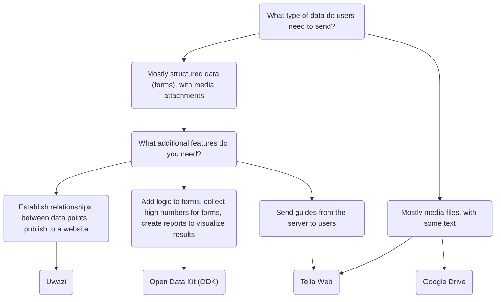

# Tella for organizations - Overview 

In addition to keeping the data protected within the app, users can also connect to a server to securely back up their data. This is typically  a server managed by organizations, where they can centralize the data collected by volunteers or activists on the ground. These individuals gather information using Tella on their phones and then send it to their organizations.

Previous Tella deployments, where on-the-ground users collected data and sent it to an organization's server, have ranged from 1 to 2,000 users. 📲 📡. You can read user stories [here](/user-stories), or you can contact us so that we can assist you in finding the best way to use Tella for your organization.

Currently, Tella can be connected to the following types of servers:

* [Open Data Kit (ODK)](#open-data-kit-odk)
* [Uwazi](#uwazi)
* [Tella Web](#tella-web)
* [Google Drive](#g-drive)

These are called [Connections](/features#connecting-to-servers) in Tella.

## Selecting the right type of server {#selecting-the-right-type-of-server}

The following is a basic, non-comprehensive graph to help determine which of the three server types is best suited to different needs. This is a good starting point, but you can also watch [this video](/video-tutorials#connections-full-video) where we present each server type. If you need help deciding or would like to request a new Connection (an integration to a new server type), [contact us!](/contact-us).

### Tella Web {#tella-web}

Tella Web is an open-source tool that enables individuals and organizations to centralize and manage reports sent by Tella users, including photos, videos, pdf documents and audio files. 

It is not the web equivalent of the mobile app; rather, it is a tool specifically designed for centralizing and managing reports sent through Tella in the simplest way possible. With Tella Web, you can create projects, which function like folders where Tella users can submit reports. For instance, you can create projects for specific geographic areas or themes such as police violence, gender-based violence, and environmental abuse. On Tella Web, you can also manage users who have the ability to upload reports to each project, assign different roles, and set permissions.

Tella Web is developed internally by our team at Horizontal, the same team responsible for developing Tella's mobile apps. It is a user-friendly solution for managing reports in a safe and private manner. We can provide support for the installation and configuration of a Tella Web server if you don't have someone within your organization who can maintain it.

The Tella Web server connection also allows users to securely download guides, resources and information from the server directly to Tella's encrypted container.

The Tella Web connection is available on Tella Android and Tella iOS, but not yet on [Tella-FOSS](/faq#is-tella-available-on-f-droid). 

Learn more about Tella Web [here](/tella-web),

### Uwazi {#uwazi}

[Uwazi](/uwazi) is an open-source documentation tool developed by HURIDOCS. It is a flexible, web-based database application designed for human rights defenders to manage their collections of information, including documents, evidence, cases and complaints. 

Organizations who use Uwazi as a database can connect Tella to one or more of their databases to upload data. All that is required to connect Tella to Uwazi is the Uwazi database URL, and a username and password. The Uwazi database should already have one or more templates configured, which can be downloaded into Tella. Once successfully downloaded, users can easily navigate between their templates to enter details for each new record, even when there is no internet connection. When the data entry is complete, it can be saved as a draft in the Tella app or immediately uploaded to the connected Uwazi database. This enables users who work offline to collect data and upload the information when it is convenient. 

Resources to learn more about Uwazi:
* video demoing the Uwazi connection [here](/video-tutorials#uwazi).
* [More information about how to use Tella with Uwazi](/uwazi).
* [blogpost from the Uwazi team](https://huridocs.org/2022/07/the-new-tella-app-lets-uwazi-users-document-violations-safely-and-while-offline/) about the connection.
* Uwazi [website](https://uwazi.io/) and [documentation](https://uwazi.readthedocs.io/en/latest/).

:::tip
Learn more about Uwazi [here](/uwazi).
:::

### Open Data Kit (ODK) {#open-data-kit-odk}

The [Open Data Kit (ODK)](https://getodk.org/) is an open standard used to create custom forms and collect data. In order to connect a Open Data Kit server, first you need to create forms with different questions types (text, date, geolocation, media, etc) using any of the tools that are ODK-compliant.

On our [Open Data Kit server connection page](/odk) we explain how to create an account, where to find information about creating forms and how to connect to the server from Tella. You can also watch a demonstration of the ODK connection [here](/video-tutorials#open-data-kit). If you are considering using Open Data Kit or you need help to [deploy](/faq#deploying-tella) your instance, please [contact us](/contact-us). 

:::info
The ODK connection is [only available on Android](/features). 
:::

:::tip
Learn more about Open Data Kit [here](/odk).
:::

### Google Drive {#g-drive}
Tella users can sign in directly to their Google account using the Tella connections. If the user is part of an organization that uses Shared Drives, they can also submit the media files directly to a Shared Drive they have access to. Information will be saved into a folder, with a name and a description that the users can select from Tella.

Offline support (Draft, Outbox tab and Submit Later) is available for the Google Drive server connection, like for all the other server connections available in Tella. 

Learn more about the Google Drive integration [here](/g-drive),

:::info
The Google Drive connection is [only available on iOS](/features). We are currently working for adding it to Tella Android as well.
:::

