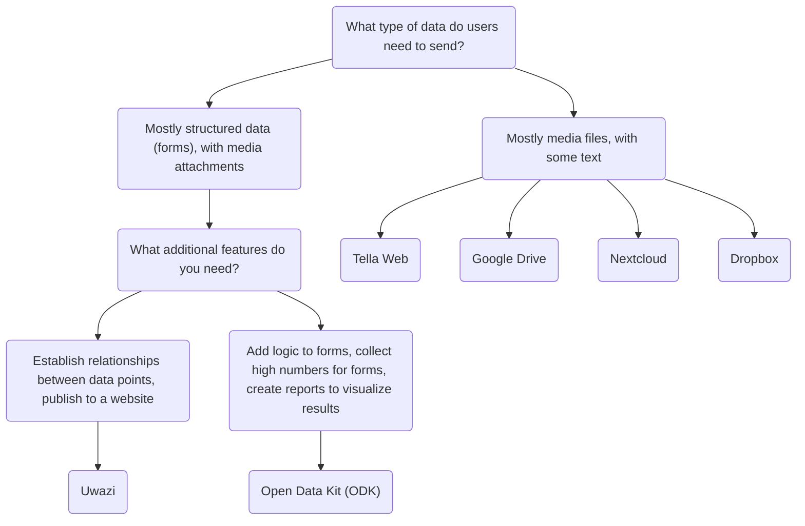

import ConnectionsTable from '.././_connections-table.md';

# Tella for organizations - Overview 

In addition to keeping the data protected within the app, users can also connect to a server to securely back up their data. This is typically  a server managed by organizations, where they can centralize the data collected by volunteers or activists on the ground. These individuals gather information using Tella on their phones and then send it to their organizations.

Previous Tella deployments, where on-the-ground users collected data and sent it to an organization's server, have ranged from 1 to 2,000 users. 📲 📡. You can read user stories [here](/user-stories), or you can contact us so that we can assist you in finding the best way to use Tella for your organization.

Currently, Tella can be connected to the following types of servers:

* [Open Data Kit (ODK)](/odk)
* [Uwazi](/uwazi)
* [Tella Web](/tella-web)
* [Google Drive](/g-drive)
* [Nextcloud](/nextcloud)
* [Dropbox](/dropbox)

These are called [Connections](/features#connecting-to-servers) in Tella.

:::danger
For the moment, the files you submit to any type of server will be saved un-encrypted. People who have permissions to see the content of the server itself will be able to see the files. Connection and submission is established though HTTPS but the file itself will need to be decrypted to be accessible outside of the Tella vault. We recommend you to read and understand the permissions structure of each of the servers to understand what alternative might be better and safer for your use-case.
:::

## Selecting the right type of server {#selecting-the-right-type-of-server}

The following is a basic, non-comprehensive graph to help determine which server types is best suited to different needs. This is a good starting point, but you can also watch [this video](/video-tutorials#connections-full-video) where we present each server type. If you need help deciding or would like to request a new Connection (an integration to a new server type), [contact us!](/contact-us).

On this table we explain what server types are available on the Tella apps:
<ConnectionsTable/>

### Tella Web {#tella-web}

Tella Web is an open-source tool that enables individuals and organizations to centralize and manage reports sent by Tella users, including photos, videos, pdf documents and audio files. 

It is not the web equivalent of the mobile app; rather, it is a tool specifically designed for centralizing and managing reports sent through Tella in the simplest way possible. With Tella Web, you can create projects, which function like folders where Tella users can submit reports. For instance, you can create projects for specific geographic areas or themes such as police violence, gender-based violence, and environmental abuse. On Tella Web, you can also manage users who have the ability to upload reports to each project, assign different roles, and set permissions.

Tella Web is developed internally by our team at Horizontal, the same team responsible for developing Tella's mobile apps. It is a user-friendly solution for managing reports in a safe and private manner. We can provide support for the installation and configuration of a Tella Web server if you don't have someone within your organization who can maintain it.

The Tella Web server connection also allows users to securely download guides, resources and information from the server directly to Tella's encrypted container.

The Tella Web connection is available on Tella Android and Tella iOS, but not yet on [Tella-FOSS](/faq#is-tella-available-on-f-droid). 

:::tip
Learn more about Tella Web [here](/tella-web),
:::

### Uwazi {#uwazi}

[Uwazi](/uwazi) is an open-source documentation tool developed by HURIDOCS. It is a flexible, web-based database application designed for human rights defenders to manage their collections of information, including documents, evidence, cases and complaints. 

Organizations who use Uwazi as a database can connect Tella to one or more of their databases to upload data. All that is required to connect Tella to Uwazi is the Uwazi database URL, and a username and password. The Uwazi database should already have one or more templates configured, which can be downloaded into Tella. Once successfully downloaded, users can easily navigate between their templates to enter details for each new record, even when there is no internet connection. When the data entry is complete, it can be saved as a draft in the Tella app or immediately uploaded to the connected Uwazi database. This enables users who work offline to collect data and upload the information when it is convenient. 

Resources to learn more about Uwazi:
* video demoing the Uwazi connection [here](/video-tutorials#uwazi).
* [More information about how to use Tella with Uwazi](/uwazi).
* [blogpost from the Uwazi team](https://huridocs.org/2022/07/the-new-tella-app-lets-uwazi-users-document-violations-safely-and-while-offline/) about the connection.
* Uwazi [website](https://uwazi.io/) and [documentation](https://uwazi.readthedocs.io/en/latest/).

:::tip
Learn more about Uwazi [here](/uwazi).
:::

### Open Data Kit (ODK) {#open-data-kit-odk}

The [Open Data Kit (ODK)](https://getodk.org/) is an open standard used to create custom forms and collect data. In order to connect a Open Data Kit server, first you need to create forms with different questions types (text, date, geolocation, media, etc) using any of the tools that are ODK-compliant.

On our [Open Data Kit server connection page](/odk) we explain how to create an account, where to find information about creating forms and how to connect to the server from Tella. You can also watch a demonstration of the ODK connection [here](/video-tutorials#open-data-kit). If you are considering using Open Data Kit or you need help to [deploy](/faq#deploying-tella) your instance, please [contact us](/contact-us). 

:::info
The ODK connection is [only available on Android](/features). 
:::

:::tip
Learn more about Open Data Kit [here](/odk).
:::

### Google Drive {#g-drive}

Users can sign-in directly to their Google account from within Tella and upload files to a folder in their Drive account. If the user is part of an organization that uses Google Workspace, they can also submit the files directly to a Shared Drive they have access to. Each "report" uploaded will create a new folder in Drive.

As for all Connections in Tella, users can use most of the Google Drive connection offline through the Draft, Outbox and Submit Later tabs. 

:::tip
Learn more about the Google Drive connection [here](/g-drive),
:::

### Nextcloud {#nextcloud}
Users can sign-in directly to their NextCloud account from within Tella and upload files to a folder in their NextCloud account. Each "report" uploaded will create a new folder in NextCloud.

As for all Connections in Tella, users can use most of the NextCloud connection offline through the Draft, Outbox and Submit Later tabs. 

:::tip
Learn more about the Nextcloud connection [here](/nextcloud),
:::

### Dropbox {#dropbox}
Users can sign-in directly to their Dropbox account from within Tella and upload files to a folder in their account. In the "Applications" folder in the user's Dropbox account, a new folder "Tella" will automatically be created. Each Report uploaded from Tella will create a new subfolder inside the "Tella" folder.

As for all Connections in Tella, users can use most of the Dropbox connection offline through the Draft, Outbox and Submit Later tabs. 

:::tip
Learn more about [the Dropbox connection here](/dropbox),
:::

