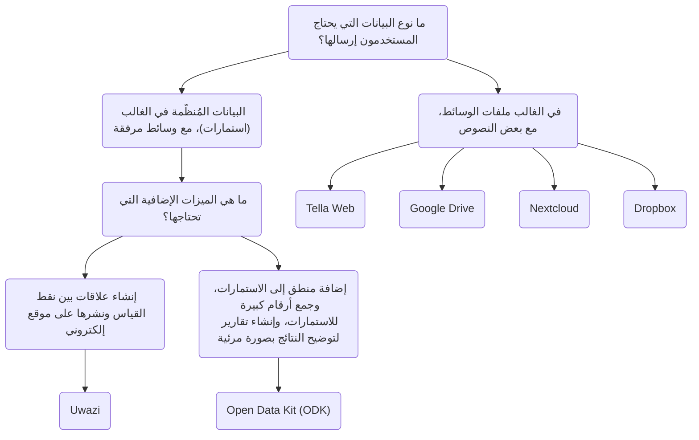

import ConnectionsTable from '.././_connections-table.mdx';
import Button from '@site/src/components/Button';
import Admonition from '@theme/Admonition';

# Tella للمنظمات

بالإضافة إلى حماية البيانات داخل التطبيق، يمكن للمستخدمين أيضا الاتصال بخادم لنسخ بياناتهم احتياطيا بشكل آمن. والذي عادة ما يكون خادما تديره المنظمات، حيث يمكنهم جمع البيانات التي يجمعها المتطوعون أو النشطاء في أرض الواقع. يجمع هؤلاء الأفراد المعلومات باستخدام تطبيق Tella على هواتفهم ثم يرسلونها إلى منظماتهم.

تراوحت عمليات النشر السابقة لـ Tella بين مستخدم واحد إلى 2000 مستخدم، حيث جمع المستخدمون على أرض الواقع البيانات وأرسلوها إلى خادم منظمة. يمكنك قراءة قصص المستخدمين [هنا](/user-stories)، أو يمكنك [الاتصال بنا](/contact-us) حتى نتمكن من مساعدتك في العثور على أفضل طريقة لاستخدام Tella في منظمتك.

حاليا، يمكن ربط Tella بأنواع الخوادم التالية:

* [Open Data Kit (ODK)](/odk)
* [Uwazi](/uwazi)
* [Tella Web](/tella-web)
* [Google Drive](/g-drive)
* [Nextcloud](/nextcloud)
* [Dropbox](/dropbox)

وتُسمى هذه [اتصالات](/features#connecting-to-servers) في Tella.

<Admonition type="danger">
For now, any files you submit to a connection might stored unencrypted on that server or drive (that depends on the server configuration). This means that anyone with permission to access the content of that server or drive may be able to view those files. While the connection used to submit files is secured via HTTPS, the files themselves must be decrypted to be accessed outside of the Tella vault.

We strongly recommend reviewing and understanding the permission model of each connection you use, in order to determine which option is safest and most appropriate for your specific use case.
</Admonition>

## اختيار نوع الخادم المناسب {/* #selecting-the-right-type-of-server */}

في ما يلي رسم بياني بسيط وغير شامل للمساعدة في تحديد أي نوع من أنواع الخوادم الأنسب للاحتياجات المختلفة. هذه نقطة انطلاق جيدة، ولكن يمكنك أيضا مشاهدة [هذا الفيديو](/video-tutorials#connections-full-video) حيث نعرض كل نوع من أنواع الخوادم. إذا كنت بحاجة إلى المساعدة في اتخاذ قرار ما أو تود طلب اتصال جديد (الدمج مع نوع جديد من الخوادم)، [اتصل بنا!](/contact-us).

On this table we explain what server types are available on the Tella apps:
<ConnectionsTable/>

<Admonition type="info">
For offline file sharing or during internet shutdowns, [Nearby Sharing](/nearby-sharing) could be helpful.  If you need to share files with other apps the [Share button](/features#share-button) could be useful.
</Admonition>

### Tella Web {/* #tella-web */}

Tella Web هي أداة مفتوحة المصدر تُمكِّن الأفراد والمنظمات من الإدارة والتجميع المُمركَز للتقارير التي يرسلها مستخدمو Tella، بما في ذلك الصور ومقاطع الفيديو والملفات الصوتية.

إنه ليس عبارة عن نسخة وِبْ للتطبيق المحمول؛ بل هي أداة مصممة خصيصا لجعل التقارير المرسلة عبر Tella ممركزة ولإدارتها بأبسط طريقة ممكنة. مع Tella Web، يمكنك إنشاء المشاريع، والتي تعمل مثل المجلدات حيث يمكن لمستخدمي Tella إرسال التقارير. مثلا، يمكنك إنشاء مشاريع لمناطق جغرافية أو لمواضيع محددة مثل عنف الشرطة والعنف القائم على الجنس أو النوع والانتهاكات البيئية. على Tella Web، يمكنك أيضا إدارة المستخدمين الذين بإمكانهم تحميل التقارير إلى كل مشروع، وتعيين أدوار مختلفة، وتعيين التراخيص.

تم تطوير Tella Web داخليا من قبل فريقنا في Horizontal، نفس الفريق المسؤول عن تطوير تطبيقات Tella المحمولة. إنه تطبيق سهل الاستخدام لإدارة التقارير بطريقة آمنة وخاصة. يمكننا تقديم الدعم لتثبيت وتهيئة خادم Tella Web إذا لم يكن لديك شخص في منظمتك يمكنه صيانته.

يتيح اتصال Tella Web للمستخدمين تنزيل الإرشادات والموارد والمعلومات بأمان من الخادم مباشرة إلى حاوية تيلا المعمّاة.

<Button label="Continue reading about the Tella Web connection " link="/tella-web"/>

### Uwazi {/* #uwazi */}

[Uwazi](/uwazi) عبارة عن أداة توثيق مفتوحة المصدر تم تطويرها بواسطة HURIDOCS. وهو تطبيق قاعدة بيانات مرن قائم على الويب مصمم للمدافعين عن حقوق الإنسان لإدارة ما يتم جمعه من المعلومات، بما في ذلك المستندات والأدلة والقضايا والشكاوي.

يمكن للمنظمات التي تستخدم Uwazi كقاعدة بياناتها أن تربط Tella بعدة قواعد بياناتها لتحميل البيانات. كل ما يتطلبه الأمر لربط Tella بقاعدة بيانات Uwazi هو عنوان موقع قاعدة بيانات Uwazi واسم المستخدم وكلمة السر. يجب أن تحتوي قاعدة بيانات Uwazi على قالب واحد مُهيَّأ على الأقل، والذي يمكن تنزيله في Tella. بمجرد تنزيل القوالب بنجاح، يمكن للمستخدمين التنقل بسهولة بين قوالبهم لإدخال تفاصيل لكل سجل جديد، حتى عند غياب الاتصال بالانترنت. عند اكتمال إدخال البيانات، يمكن حفظها كمُسوَّدة في تطبيق Tella أو تحميلها على الفور إلى قاعدة بيانات Uwazi المتصلة. هذا يُمكِّن المستخدمين الذين يعملون دون اتصال الانترنت من جمع البيانات وتحميل المعلومات عندما يكون ذلك مناسبا.

<Button label="Continue reading about the Uwazi connection " link="/uwazi"/>

### Open Data Kit (ODK) {/* #open-data-kit-odk */}

[Open Data Kit (ODK)](https://getodk.org/) عبارة عن معيار مفتوح يستخدم لإنشاء استمارات مخصصة وجمع البيانات. من أجل الاتصال بخادم Open Data Kit، ستحتاج أولا إلى إنشاء نماذج بأنواع مختلفة من الأسئلة (نص، تاريخ، موقع جغرافي، وسائط، إلخ) باستخدام أي من الأدوات المتوافقة مع ODK.

على [صفحة الاتصال بخادم Open Data Kit](/odk)، نشرح كيفية إنشاء الحساب، وأين يمكن العثور على المعلومات حول إنشاء الاستمارات وكيفية الاتصال بالخادم من Tella. يمكنك أيضا مشاهدة عرض توضيحي لاتصال ODK [هنا](/video-tutorials#open-data-kit). إذا كنت تفكر في استخدام Open Data Kit أو تحتاج إلى المساعدة [لنشر](/faq#deploying-tella) نموذجك، [اتصل بنا](/contact-us) من فضلك.

<Admonition type="note">
The ODK connection is [not available on Tella iOS](/features). 
</Admonition>

<Button label="Continue reading about the Open Data Kit connection " link="/odk"/>

### Google Drive {/* #g-drive */}

Users can sign-in directly to their Google account from within Tella and upload files to a folder in their Drive account. Each "report" uploaded will create a new folder in the user's Google Drive.

As for all Connections in Tella, users can use most of the Google Drive connection offline through the Draft, Outbox and Submit Later tabs. 

<Admonition type="note">
The Google Drive connection is not available in Tella Android FOSS, because it uses closed-sourced libraries.
</Admonition>

<Button label="Continue reading about the Google Drive connection " link="/g-drive"/>

### Nextcloud {/* #Nextcloud */}

Users can sign-in directly to their Nextcloud account from within Tella and upload files to a folder in their Nextcloud account. Each "report" uploaded will create a new folder in the user's Nextcloud.

As for all Connections in Tella, users can use most of the Nextcloud connection offline through the Draft, Outbox and Submit Later tabs. 

<Button label="Continue reading about the Nextcloud connection " link="/nextcloud"/>

### Dropbox {/* #dropbox */}

Users can sign-in directly to their Dropbox account from within Tella and upload files to a folder in their account. In the "Applications" folder in the user's Dropbox account, a new folder "Tella" will automatically be created. Each Report uploaded from Tella will create a new subfolder inside the "Tella" folder.

As for all Connections in Tella, users can use most of the Dropbox connection offline through the Draft, Outbox and Submit Later tabs. 

<Admonition type="note">
The Dropbox connection is not available in Tella Android FOSS, because it uses closed-sourced libraries.
</Admonition>

<Button label="Continue reading about the Dropbox connection " link="/dropbox"/>
