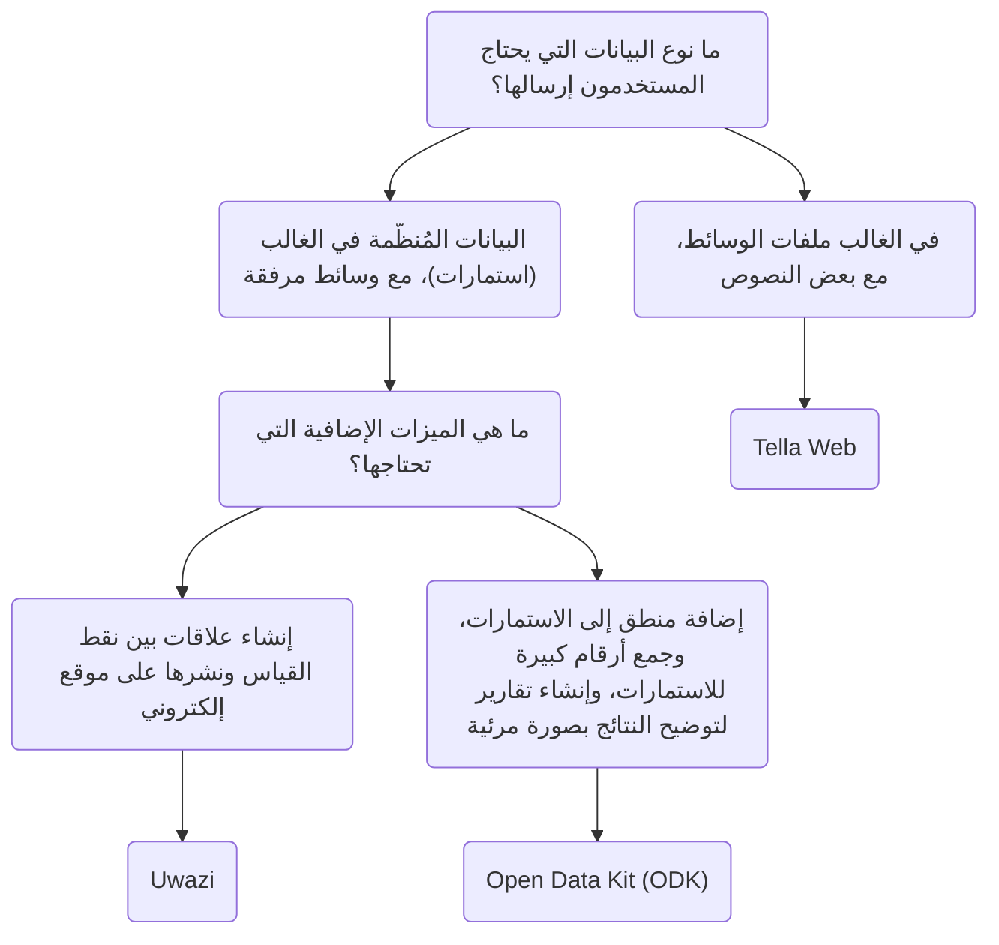

# Tella للمنظمات - نظرة عامة

بالإضافة إلى حماية البيانات داخل التطبيق، يمكن للمستخدمين أيضا الاتصال بخادم لنسخ بياناتهم احتياطيا بشكل آمن. والذي عادة ما يكون خادما تديره المنظمات، حيث يمكنهم جعل البيانات التي يجمعها المتطوعون أو النشطاء في أرض الواقع مُمَركزة. يجمع هؤلاء الأفراد المعلومات باستخدام تطبيق Tella على هواتفهم ثم يرسلونها إلى منظماتهم.

تراوحت عمليات النشر السابقة لـ Tella بين مستخدم واحد إلى 2000 مستخدم، حيث جمع المستخدمون على أرض الواقع البيانات وأرسلوها إلى خادم منظمة. 📲 📡. يمكنك قراءة قصص المستخدمين [هنا](/user-stories)، أو يمكنك الاتصال بنا حتى نتمكن من مساعدتك في العثور على أفضل طريقة لاستخدام Tella في منظمتك.

حاليا، يمكن ربط Tella بأنواع الخوادم التالية:

* [Open Data Kit (ODK)](#open-data-kit-odk)
* [Uwazi](#uwazi)
* [Tella Web](#tella-web)

وتُسمى هذه [اتصالات](/features#connecting-to-servers) في Tella.

## اختيار نوع الخادم المناسب {#selecting-the-right-type-of-server}

في ما يلي رسم بياني بسيط وغير شامل للمساعدة في تحديد أي نوع من أنواع الخوادم الثلاثة الأنسب  للاحتياجات المختلفة. هذه نقطة انطلاق جيدة، ولكن يمكنك أيضا مشاهدة [هذا الفيديو](/video-tutorials#connections-full-video) حيث نعرض كل نوع من أنواع الخوادم. إذا كنت بحاجة إلى المساعدة في اتخاذ قرار ما أو تود طلب اتصال جديد (الدمج مع نوع جديد من الخوادم)، [اتصل بنا!](/contact-us)

### Tella Web {#tella-web}

Tella Web هي أداة مفتوحة المصدر تُمكِّن الأفراد والمنظمات من الإدارة والتجميع المُمركَز للتقارير التي يرسلها مستخدمو Tella، بما في ذلك الصور ومقاطع الفيديو ومستندات PDF والملفات الصوتية.

إنه ليس عبارة عن نسخة وِبْ للتطبيق المحمول؛ بل هي أداة مصممة خصيصا لجعل التقارير المرسلة عبر Tella ممركزة ولإدارتها بأبسط طريقة ممكنة. مع Tella Web، يمكنك إنشاء المشاريع، والتي تعمل مثل المجلدات حيث يمكن لمستخدمي Tella إرسال التقارير. مثلا، يمكنك إنشاء مشاريع لمناطق جغرافية أو لمواضيع محددة مثل عنف الشرطة والعنف القائم على الجنس أو النوع والانتهاكات البيئية. على Tella Web، يمكنك أيضا إدارة المستخدمين الذين بإمكانهم تحميل التقارير إلى كل مشروع، وتعيين أدوار مختلفة، وتعيين التراخيص.

تم تطوير Tella Web داخليا من قبل فريقنا في Horizontal، نفس الفريق المسؤول عن تطوير تطبيقات Tella المحمولة. إنه تطبيق سهل الاستخدام لإدارة التقارير بطريقة آمنة وخاصة. يمكننا تقديم الدعم لتثبيت وتهيئة خادم Tella Web إذا لم يكن لديك شخص في منظمتك يمكنه صيانته.

يتوفر اتصال Tella Web على Tella Android وTella iOS، ولكن ليس بعد على [Tella-FOSS](/faq#is-tella-available-on-f-droid).

تعرف على المزيد حول Tella Web [هنا](/tella-web)

### Uwazi {#uwazi}

[Uwazi](/uwazi) عبارة عن أداة توثيق مفتوحة المصدر تم تطويرها بواسطة HURIDOCS. وهو تطبيق قاعدة بيانات مرن قائم على الويب مصمم للمدافعين عن حقوق الإنسان لإدارة ما يتم جمعه من المعلومات، بما في ذلك المستندات والأدلة والقضايا والشكاوي.

يمكن للمنظمات التي تستخدم Uwazi كقاعدة بياناتها أن تربط Tella بعدة قواعد بياناتها لتحميل البيانات. كل ما يتطلبه الأمر لربط Tella بقاعدة بيانات Uwazi هو عنوان موقع قاعدة بيانات Uwazi واسم المستخدم وكلمة السر. يجب أن تحتوي قاعدة بيانات Uwazi على قالب واحد مُهيَّأ على الأقل، والذي يمكن تنزيله في Tella. بمجرد تنزيل القوالب بنجاح، يمكن للمستخدمين التنقل بسهولة بين قوالبهم لإدخال تفاصيل لكل سجل جديد، حتى عند غياب الاتصال بالانترنت. عند اكتمال إدخال البيانات، يمكن حفظها كمُسوَّدة في تطبيق Tella أو تحميلها على الفور إلى قاعدة بيانات Uwazi المتصلة. هذا يُمكِّن المستخدمين الذين يعملون دون اتصال الانترنت من جمع البيانات وتحميل المعلومات عندما يكون ذلك مناسبا.

موارد لمعرفة المزيد عن Uwazi:
* فيديو توضيحي لاتصال Uwazi [هنا](/video-tutorials#uwazi).
* [مزيد من المعلومات حول كيفية استخدام Tella مع Uwazi](/uwazi).
* [تدوينة من فريق Uwazi](https://huridocs.org/2022/07/the-new-tella-app-lets-uwazi-users-document-violations-safely-and-while-offline/) حول الاتصال.
* Uwazi [الموقع الإلكتروني](https://uwazi.io/) و [التوثيقات](https://uwazi.readthedocs.io/en/latest/).

### Open Data Kit (ODK) {#open-data-kit-odk}

[Open Data Kit (ODK)](https://getodk.org/) عبارة عن معيار مفتوح يستخدم لإنشاء استمارات مخصصة وجمع البيانات. من أجل الاتصال بخادم Open Data Kit، ستحتاج أولا إلى إنشاء نماذج بأنواع مختلفة من الأسئلة (نص، تاريخ، موقع جغرافي، وسائط، إلخ) باستخدام أي من الأدوات المتوافقة مع ODK.

على [صفحة الاتصال بخادم Open Data Kit](/odk)، نشرح كيفية إنشاء الحساب، وأين يمكن العثور على المعلومات حول إنشاء الاستمارات وكيفية الاتصال بالخادم من Tella. إذا كنت تفكر في استخدام Open Data Kit أو تحتاج إلى المساعدة [لنشر](/faq#deploying-tella) نموذجك، [اتصل بنا](/contact-us) من فضلك.

:::info
اتصال ODK [متوفر فقط على أندرويد](/features). 
:::

:::tip
يمكنك أيضا مشاهدة عرض توضيحي لاتصال ODK [هنا](/video-tutorials#open-data-kit).
:::

