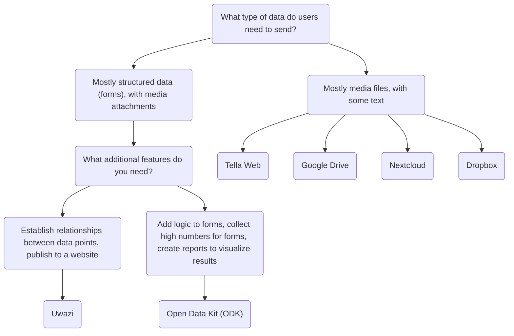

import ConnectionsTable from '.././_connections-table.md';

# Tella para organizaciones - Vista general

Además de mantener los datos protegidos dentro de la app, la(o)s usuaria(o)s también pueden conectarse a un servidor para respaldar sus datos de manera segura. Esto normalmente es un servidor administrado por las organizaciones, dónde pueden centralizar los datos recopilados por voluntaria(o)s y activistas sobre el terreno. Estos individuos obtienen información utilizando Tella en sus teléfonos y luego la envían a sus organizaciones. 

Las implementaciones anteriores de Tella, donde la(o)s usuaria(o)s sobre el terreno recopilaban datos y los enviaban a un servidor de la organización, han oscilado entre 1 a 2000 usuaria(o)s. 📲 📡. Puedes leer historias de usuaria(o)s [aquí](/user-stories), o puedes contactarnos para que podamos ayudarte a encontrar la mejor manera de usar Tella para tu organización.

Actualmente, Tella puede ser conectada a los siguientes tipos de servidores:

* [Open Data Kit (ODK)](/odk)
* [Uwazi](/uwazi)
* [Tella Web](/tella-web)
* [Google Drive](/g-drive)
* [Nextcloud](/nextcloud)
* [Dropbox](/dropbox)

Estas son llamadas [Conexiones](/features#connecting-to-servers) en Tella.

:::danger
For now, any files you submit to a connection are stored unencrypted on that server or drive. This means that anyone with permission to access the content of that server or drive may be able to view those files. While the connection used to submit files is secured via HTTPS, the files themselves must be decrypted to be accessed outside of the Tella vault.

We strongly recommend reviewing and understanding the permission model of each connection you use, in order to determine which option is safest and most appropriate for your specific use case.
:::

## Seleccionando el tipo de servidor adecuado {#selecting-the-right-type-of-server}

El siguiente es un gráfico básico, no exhaustivo para ayudar a determinar cuales tipos de servidores se adaptan mejor a diferentes necesidades. Este es un buen punto de inicio, pero también puedes ver [este video](/video-tutorials#connections-full-video) donde presentamos cada tipo de servidor. Si necesitas ayuda para decidir o te gustaría solicitar una nueva Conexión (una integración a un nuevo tipo de servidor), [contáctanos](/contact-us).

En esta tabla explicamos qué tipos de servidores están disponibles en las apps de Tella:
<ConnectionsTable/>

### Tella Web {#tella-web}

Tella Web es una herramienta de código abierto que permite a individuos y organizaciones a centralizar y gestionar informes enviados por la(o)s usuaria(o)s de Tella, incluyendo fotos, videos, documentos pdf y archivos de audio.

No es el equivalente web de una app móvil; más bien, es una herramienta diseñada específicamente para centralizar y gestionar informes enviados a través de Tella de la manera más simple posible. Con Tella Web, puedes crear proyectos, que funcionan como carpetas dónde la(o)s usuaria(os) de Tella pueden enviar informes. Por ejemplo, puedes crear proyectos para áreas geográficas específicas o temas como la violencia policial, violencia de género, y abuso medioambiental. En Tella Web, también puedes gestionar usuaria(o)s que tienen la habilidad de subir informes a cada proyecto, asignar diferentes roles, y establecer permisos.

Tella Web es desarrollada internamente por nuestro equipo en Horizontal, el mismo equipo responsable de desarrollar la app móvil de Tella. Es una solución amigable a sus usuaria(o)s para gestionar informes de una manera segura y privada. Podemos proporcionar soporte para la instalación y configuración de un servidor de Tella Web si no tienes alguien dentro de tu organización que pueda mantenerlo.

La conexión a servidor Tella Web también permite a los usuarios descargar de manera segura guías, recursos e información del servidor directamente al contenedor cifrado de Tella.

La conexión Tella Web está disponible en Tella Android y Tella iOS, pero aún no en [Tella-FOSS](/faq#is-tella-available-on-f-droid).

:::
Aprende más sobre Tella Web [aquí](/tella-web).
:::

### Uwazi {#uwazi}

[Uwazi](/uwazi) es una herramienta de documentación de código abierto desarrollada por HURIDOCS. Es una aplicación de base de datos, flexible, basada en la web diseñada para que la(o)s defensora(e)s de derechos humanos administren sus recopilaciones de información, incluyendo documentos, evidencias, casos y reclamaciones.

Organizaciones que usan Uwazi como una base de datos pueden conectar Tella a una o más de sus bases de datos para subir información. Todo lo requerido para conectar Tella a Uwazi es la URL de la base de datos Uwazi, y un nombre de usuaria(o) y contraseña. La base de datos Uwazi debe tener ya una o más plantillas configuradas, las cuales se pueden descargar en Tella. Una vez descargadas con éxito, la(o)s usuaria(o)s pueden navegar fácilmente entre sus plantillas para introducir detalles para cada registro nuevo, incluso cuando no haya conexión a internet. Cuando la introducción de datos se complete, se puede guardar como un borrador en la app de Tella o subida inmediatamente a la base de datos Uwazi conectada. Esto permite a la(o)s usuaria(o)s que trabajan fuera de línea recopilar los datos y subir la información cuando sea conveniente.

Recursos para aprender más sobre Uwazi:
* video demostrando la conexión Uwazi [aquí](/video-tutorials#uwazi).
* [Más información sobre cómo usar Tella con Uwazi](/uwazi).
* [publicación de blog del equipo de Uwazi](https://huridocs.org/2022/07/the-new-tella-app-lets-uwazi-users-document-violations-safely-and-while-offline/) sobre la conexión.
* Uwazi [sitio web](https://uwazi.io/) y [documentación](https://uwazi.readthedocs.io/en/latest/).

:::
Aprende más sobre Uwazi [aquí](/uwazi).
:::

### Open Data Kit (ODK - Kit de Datos Abiertos) {#open-data-kit-odk}

El [Open Data Kit (ODK - Kit de Datos Abiertos)](https://getodk.org/) es un estándar abierto utilizado para crear formularios personalizados y recopilar datos. Para conectar un servidor Open Data Kit, primero debes crear formularios con diferentes tipos de preguntas (texto, fecha, geolocalización, medios, etc.) usando cualquiera de las herramientas que cumplan con el ODK.

En nuestra [página de conexión del servidor Open Data Kit](/odk) explicamos cómo crear una cuenta, dónde encontrar información sobre la creación de formularios y cómo conectar a un servidor desde Tella. También puedes ver una demostración de la conexión ODK [aquí](/video-tutorials#open-data-kit). Si estás considerando utilizar el Open Data Kit o necesitas ayuda para [implementar](/faq#deploying-tella) tu instancia, por favor [contáctanos](/contact-us).

:::note
The ODK connection is [only available on Android](/features). 
:::

:::tip
Aprende más sobre Open Data Kit [aquí](/odk).
:::

### Google Drive {#g-drive}

Users can sign-in directly to their Google account from within Tella and upload files to a folder in their Drive account. Each "report" uploaded will create a new folder in Drive.

As for all Connections in Tella, users can use most of the Google Drive connection offline through the Draft, Outbox and Submit Later tabs. 

:::note
The Google Drive connection is not available in Tella Android FOSS, because it uses closed-sourced libraries.
:::

:::tip
Aprende más sobre la conexión a Google Drive [aquí](/g-drive).
:::

### Nextcloud {#Nextcloud}
Users can sign-in directly to their Nextcloud account from within Tella and upload files to a folder in their Nextcloud account. Each "report" uploaded will create a new folder in Nextcloud.

As for all Connections in Tella, users can use most of the Nextcloud connection offline through the Draft, Outbox and Submit Later tabs. 

:::tip
Aprende más sobre la conexión a Nextcloud [aquí](/nextcloud).
:::

### Dropbox {#dropbox}
Users can sign-in directly to their Dropbox account from within Tella and upload files to a folder in their account. In the "Applications" folder in the user's Dropbox account, a new folder "Tella" will automatically be created. Each Report uploaded from Tella will create a new subfolder inside the "Tella" folder.

As for all Connections in Tella, users can use most of the Dropbox connection offline through the Draft, Outbox and Submit Later tabs. 

:::note
The Dropbox connection is not available in Tella Android FOSS, because it uses closed-sourced libraries.
:::

:::tip
Learn more about [the Dropbox connection here](/dropbox),
:::

