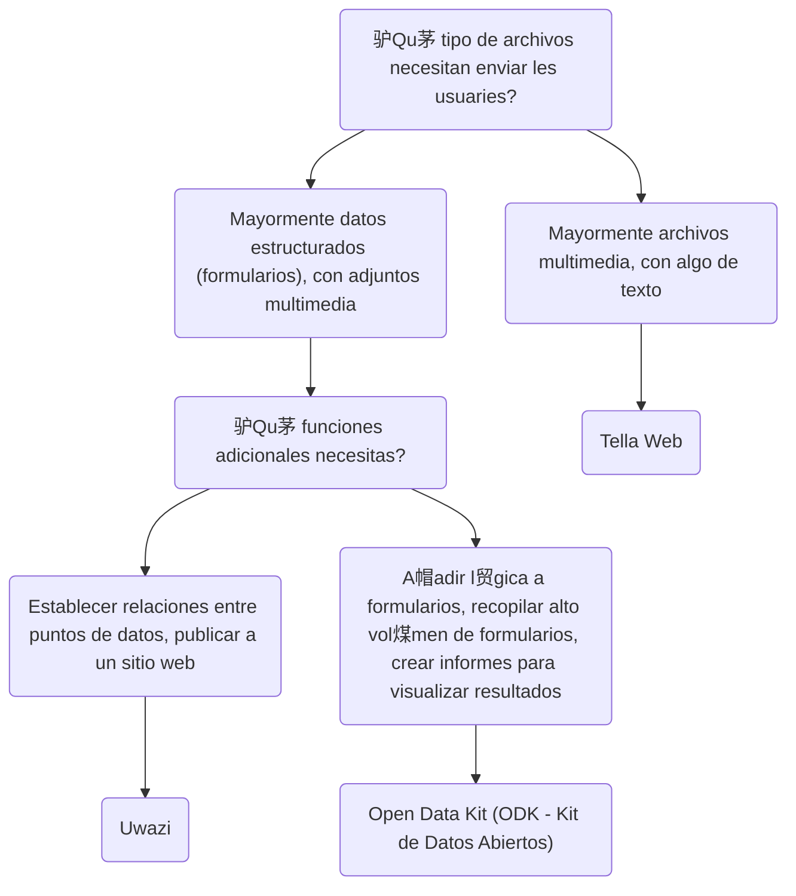

# Tella para organizaciones - Vista general

Adem谩s de mantener los datos protegidos dentro de la app, la(o)s usuaria(o)s tambi茅n pueden conectarse a un servidor para respaldar sus datos de manera segura. Esto normalmente es un servidor administrado por las organizaciones, d贸nde pueden centralizar los datos recopilados por voluntaria(o)s y activistas sobre el terreno. Estos individuos obtienen informaci贸n utilizando Tella en sus tel茅fonos y luego la env铆an a sus organizaciones. 

Las implementaciones anteriores de Tella, donde la(o)s usuaria(o)s sobre el terreno recopilaban datos y los enviaban a un servidor de la organizaci贸n, han oscilado entre 1 a 2000 usuaria(o)s.  . Puedes leer historias de usuaria(o)s [aqu铆](/user-stories), o puedes contactarnos para que podamos ayudarte a encontrar la mejor manera de usar Tella para tu organizaci贸n.

Actualmente, Tella puede ser conectada a los siguientes tipos de servidores:

* [Open Data Kit (ODK - Kit de Datos Abiertos)](#open-data-kit-odk)
* [Uwazi](#uwazi)
* [Tella Web](#tella-web)

Estas son llamadas [Conexiones](/features#connecting-to-servers) en Tella.

## Seleccionando el tipo de servidor adecuado {#selecting-the-right-type-of-server}

El siguiente es un gr谩fico b谩sico, no exhaustivo para ayudar a determinar cu谩l de los tres tipos de servidores se adapta mejor a diferentes necesidades. Este es un buen punto de inicio, pero tambi茅n puedes ver [este video](/video-tutorials#connections-full-video) donde presentamos cada tipo de servidor. Si necesitas ayuda para decir o te gustar铆a solicitar una nueva Conexi贸n (una integraci贸n a un nuevo tipo de servidor), [cont谩ctanos](/contact-us)

```mermaid
graph TD;
    id1(驴Qu茅 tipo de archivos necesitan enviar les usuaries?) --> id2("Mayormente datos estructurados (formularios), con adjuntos multimedia");
    id1 --> id3("Mayormente archivos multimedia, con algo de texto") ;
    id2 --> id4("驴Qu茅 funciones adicionales necesitas?");
    id3 --> id5("Tella Web");
    id4 --> id6("Establecer relaciones entre puntos de datos, publicar a un sitio web")
    id4 --> id7("A帽adir l贸gica a formularios, recopilar alto vol煤men de formularios, crear informes para visualizar resultados")
    id6 --> id8("Uwazi")
    id7 --> id9("Open Data Kit (ODK - Kit de Datos Abiertos)")
```

### Tella Web {#tella-web}

Tella Web es una herramienta de c贸digo abierto que permite a individuos y organizaciones a centralizar y gestionar informes enviados por la(o)s usuaria(o)s de Tella, incluyendo fotos, videos, documentos pdf y archivos de audio.

No es el equivalente web de una app m贸vil; m谩s bien, es una herramienta dise帽ada espec铆ficamente para centralizar y gestionar informes enviados a trav茅s de Tella de la manera m谩s simple posible. Con Tella Web, puedes crear proyectos, que funcionan como carpetas d贸nde la(o)s usuaria(os) de Tella pueden enviar informes. Por ejemplo, puedes crear proyectos para 谩reas geogr谩ficas espec铆ficas o temas como la violencia policial, violencia de g茅nero, y abuso medioambiental. En Tella Web, tambi茅n puedes gestionar usuaria(o)s que tienen la habilidad de subir informes a cada proyecto, asignar diferentes roles, y establecer permisos.

Tella Web es desarrollada internamente por nuestro equipo en Horizontal, el mismo equipo responsable de desarrollar la app m贸vil de Tella. Es una soluci贸n amigable a sus usuaria(o)s para gestionar informes de una manera segura y privada. Podemos proporcionar soporte para la instalaci贸n y configuraci贸n de un servidor de Tella Web si no tienes alguien dentro de tu organizaci贸n que pueda mantenerlo.

La conexi贸n Tella Web est谩 disponible en Tella Android y Tella iOS, pero a煤n no en [Tella-FOSS](/faq#is-tella-available-on-f-droid).

Aprende m谩s sobre Tella Web [aqu铆](/tella-web)

### Uwazi {#uwazi}

[Uwazi](/uwazi) es una herramienta de documentaci贸n de c贸digo abierto desarrollada por HURIDOCS. Es una aplicaci贸n de base de datos, flexible, basada en la web dise帽ada para que la(o)s defensora(e)s de derechos humanos administren sus recopilaciones de informaci贸n, incluyendo documentos, evidencias, casos y reclamaciones.

Organizaciones que usan Uwazi como una base de datos pueden conectar Tella a una o m谩s de sus bases de datos para subir informaci贸n. Todo lo requerido para conectar Tella a Uwazi es la URL de la base de datos Uwazi, y un nombre de usuaria(o) y contrase帽a. La base de datos Uwazi debe tener ya una o m谩s plantillas configuradas, las cuales se pueden descargar en Tella. Una vez descargadas con 茅xito, la(o)s usuaria(o)s pueden navegar f谩cilmente entre sus plantillas para introducir detalles para cada registro nuevo, incluso cuando no haya conexi贸n a internet. Cuando la introducci贸n de datos se complete, se puede guardar como un borrador en la app de Tella o subida inmediatamente a la base de datos Uwazi conectada. Esto permite a la(o)s usuaria(o)s que trabajan fuera de l铆nea recopilar los datos y subir la informaci贸n cuando sea conveniente.

Recursos para aprender m谩s sobre Uwazi:
* video demostrando la conexi贸n Uwazi [aqu铆](/video-tutorials#uwazi).
* [M谩s informaci贸n sobre c贸mo usar Tella con Uwazi](/uwazi).
* [publicaci贸n de blog del equipo de Uwazi](https://huridocs.org/2022/07/the-new-tella-app-lets-uwazi-users-document-violations-safely-and-while-offline/) sobre la conexi贸n.
* Uwazi [sitio web](https://uwazi.io/) y [documentaci贸n](https://uwazi.readthedocs.io/en/latest/).

### Open Data Kit (ODK - Kit de Datos Abiertos) {#open-data-kit-odk}

El [Open Data Kit (ODK - Kit de Datos Abiertos)](https://getodk.org/) es un est谩ndar abierto utilizado para crear formularios personalizados y recopilar datos. Para conectar un servidor Open Data Kit, primero debes crear formularios con diferentes tipos de preguntas (texto, fecha, geolocalizaci贸n, medios, etc.) usando cualquiera de las herramientas que cumplan con el ODK.

En nuestra [p谩gina de conexi贸n del servidor Open Data Kit](/odk) explicamos c贸mo crear una cuenta, d贸nde encontrar informaci贸n sobre la creaci贸n de formularios y c贸mo conectar a un servidor desde Tella. Si est谩s considerando utilizar el Open Data Kit o necesitas ayuda para [implementar](/faq#deploying-tella) tu instancia, por favor [cont谩ctanos](/contact-us).

:::info
La conexi贸n ODK [solo est谩 disponible en Android](/features).
:::

:::tip
Tambi茅n puedes ver una demostraci贸n de la conexi贸n ODK [aqu铆](/video-tutorials#open-data-kit).
:::

