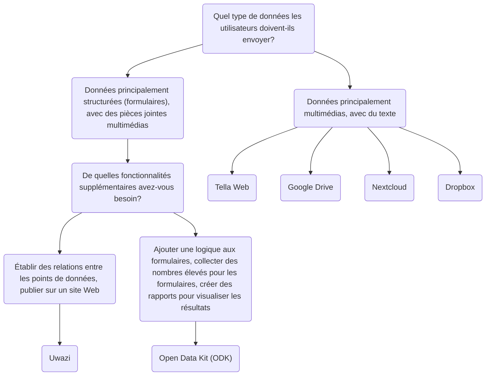

import ConnectionsTable from '.././_connections-table.mdx';
import Button from '@site/src/components/Button';

# Tella pour les organisations - Présentation

En plus d'avoir vos données protégées dans l'application, vous pouvez également vous connecter à un serveur pour sauvegarder vos données en toute sécurité. Il s'agit généralement d'un serveur géré par des organisations, où celles-ci peuvent centraliser les données collectées par des bénévoles ou des activistes sur le terrain. Ces personnes recueillent des informations à l'aide de Tella sur leur téléphone et les envoient ensuite à leur organisation.

Previous Tella deployments, where on-the-ground users collected data and sent it to an organization's server, have ranged from 1 to 2,000 users. You can read user stories [here](/user-stories), or you can [contact us](/contact-us) so that we can assist you in finding the best way to use Tella for your organization.

Actuellement, Tella peut être connecté aux types de serveurs suivants:

* [Open Data Kit (ODK)](/odk)
* [Uwazi](/uwazi)
* [Tella Web](/tella-web)
* [Google Drive](/g-drive)
* [Nextcloud](/nextcloud)
* [Dropbox](/dropbox)

These are called [Connections](/features#connecting-to-servers) in Tella.

:::danger For now, any files you submit to a connection might stored unencrypted on that server or drive (that depends on the server configuration). This means that anyone with permission to access the content of that server or drive may be able to view those files. While the connection used to submit files is secured via HTTPS, the files themselves must be decrypted to be accessed outside of the Tella vault.

Nous recommandons vivement de consulter et de comprendre le modèle de permissions de chaque connexion que vous utilisez, afin de déterminer quelle option est la plus sûre et la plus adaptée à votre cas d'usage spécifique. :::

## Sélectionner le bon type de serveur {/* #selecting-the-right-type-of-server */}

The following is a basic, non-comprehensive graph to help determine which server types is best suited to different needs. This is a good starting point, but you can also watch [this video](/video-tutorials#connections-full-video) where we present each server type. If you need help deciding or would like to request a new Connection (an integration to a new server type), [contact us!](/contact-us).

On this table we explain what server types are available on the Tella apps:
<ConnectionsTable/>

:::info For offline file sharing or during internet shutdowns, check out [Nearby Sharing](/nearby-sharing). :::

:::info If you need to share files through other apps, use the [Share button](/features#share-button). :::

### Tella Web {/* #tella-web */}

Ce n'est pas l'équivalent Web de l'application mobile ; il s'agit plutôt d'un outil spécialement conçu pour centraliser et gérer les rapports envoyés via Tella de la manière la plus simple possible. Avec Tella Web, vous pouvez créer des projets qui fonctionnent comme des dossiers dans lesquels les utilisateurs de Tella peuvent soumettre des rapports. Par exemple, vous pouvez créer des projets pour des zones géographiques ou des thèmes spécifiques tels que la violence policière, la violence sexiste et les atteintes à l'environnement. Sur Tella Web, vous pouvez également gérer les utilisateurs et utilisatrices qui ont la possibilité de télécharger des rapports sur chaque projet, d'attribuer différents rôles et de définir des autorisations.

Tella Web est développé en interne par notre équipe chez Horizontal, la même équipe responsable du développement des applications mobiles de Tella. Il s'agit d'une solution conviviale pour gérer les rapports de manière sûre et privée. Nous pouvons fournir une assistance pour l'installation et la configuration d'un serveur Web Tella si vous n'avez personne au sein de votre organisation capable de le maintenir.

La connexion au serveur Web Tella permet également aux utilisateurs de télécharger en toute sécurité des guides, des ressources et des informations depuis le serveur directement vers le conteneur crypté de Tella.

La connexion Tella Web est disponible sur Tella Android et Tella iOS, mais pas encore sur [Tella-FOSS]{1}.

<Button label="Continue reading about the Tella Web connection " link="/tella-web"/>

### Uwazi {/* #uwazi */}

[Uwazi](/uwazi) is an open-source documentation tool developed by HURIDOCS. It is a flexible, web-based database application designed for human rights defenders to manage their collections of information, including documents, evidence, cases and complaints.

Les organisations qui utilisent Uwazi comme base de données peuvent connecter Tella à une ou plusieurs de leurs bases de données pour télécharger des données. Tout ce qui est requis pour connecter Tella à Uwazi est l'URL de la base de données Uwazi, ainsi qu'un nom d'utilisateur et un mot de passe. La base de données Uwazi doit déjà avoir un ou plusieurs modèles configurés, qui peuvent être téléchargés dans Tella. Une fois le téléchargement réussi, les utilisateurs et utilisatrices peuvent facilement naviguer entre leurs modèles pour saisir les détails de chaque nouvel enregistrement, même en l'absence de connexion Internet. Une fois la saisie des données terminée, elles peuvent être enregistrées en tant que brouillon dans l'application Tella ou immédiatement téléchargées dans la base de données Uwazi connectée. Cela permet aux utilisateurs et utilisatrices qui travaillent hors ligne de collecter des données et de télécharger les informations lorsque cela leur convient.

<Button label="Continue reading about the Uwazi connection " link="/uwazi"/>

### Open Data Kit (ODK) {/* #open-data-kit-odk */}

The [Open Data Kit (ODK)](https://getodk.org/) is an open standard used to create custom forms and collect data. In order to connect a Open Data Kit server, first you need to create forms with different questions types (text, date, geolocation, media, etc) using any of the tools that are ODK-compliant.

On our [Open Data Kit server connection page](/odk) we explain how to create an account, where to find information about creating forms and how to connect to the server from Tella. You can also watch a demonstration of the ODK connection [here](/video-tutorials#open-data-kit). If you are considering using Open Data Kit or you need help to [deploy](/faq#deploying-tella) your instance, please [contact us](/contact-us).

:::note The ODK connection is [not available on Tella iOS](/features). :::

<Button label="Continue reading about the Open Data Kit connection " link="/odk"/>

### Google Drive {/* #g-drive */}

Users can sign-in directly to their Google account from within Tella and upload files to a folder in their Drive account. Each "report" uploaded will create a new folder in the user's Google Drive.

As for all Connections in Tella, users can use most of the Google Drive connection offline through the Draft, Outbox and Submit Later tabs.

<Button label="Continue reading about the Google Drive connection " link="/g-drive"/>

:::note The Google Drive connection is not available in Tella Android FOSS, because it uses closed-sourced libraries. :::

### Nextcloud {/* #Nextcloud */}
Users can sign-in directly to their Nextcloud account from within Tella and upload files to a folder in their Nextcloud account. Each "report" uploaded will create a new folder in the user's Nextcloud.

As for all Connections in Tella, users can use most of the Nextcloud connection offline through the Draft, Outbox and Submit Later tabs.

<Button label="Continue reading about the Nextcloud connection " link="/nextcloud"/>

### Dropbox {/* #dropbox */}
Users can sign-in directly to their Dropbox account from within Tella and upload files to a folder in their account. In the "Applications" folder in the user's Dropbox account, a new folder "Tella" will automatically be created. Each Report uploaded from Tella will create a new subfolder inside the "Tella" folder.

As for all Connections in Tella, users can use most of the Dropbox connection offline through the Draft, Outbox and Submit Later tabs.

<Button label="Continue reading about the Dropbox connection " link="/dropbox"/>

:::note The Dropbox connection is not available in Tella Android FOSS, because it uses closed-sourced libraries. :::

