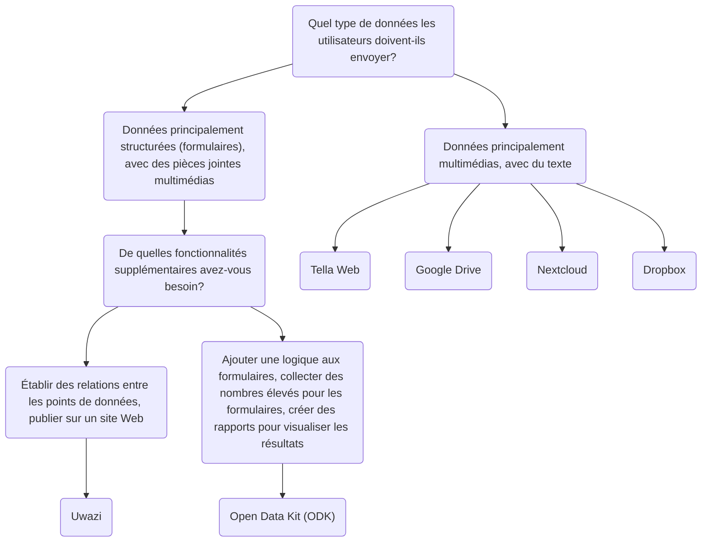

import ConnectionsTable from '.././_connections-table.md';

# Tella pour les organisations - Présentation

En plus d'avoir vos données protégées dans l'application, vous pouvez également vous connecter à un serveur pour sauvegarder vos données en toute sécurité. Il s'agit généralement d'un serveur géré par des organisations, où celles-ci peuvent centraliser les données collectées par des bénévoles ou des activistes sur le terrain. Ces personnes recueillent des informations à l'aide de Tella sur leur téléphone et les envoient ensuite à leur organisation.

Les déploiements précédents de Tella, dans lesquels les utilisateurs et utilisatrices sur le terrain collectaient des données et les envoyaient au serveur d'une organisation, comptaient entre 1 et 2000 utilisateurs. 📲 📡. Vous pouvez lire les témoignages d'utilisateurs [ici](/user-stories), ou nous contacter pour que nous vous aidions à trouver la meilleure façon d'utiliser Tella au sein de votre organisation.

Actuellement, Tella peut être connecté aux types de serveurs suivants:

* [Open Data Kit (ODK)](#open-data-kit-odk)
* [Uwazi](#uwazi)
* [Tella Web](#tella-web)
* [Google Drive](/g-drive)
* [Nextcloud](/nextcloud)
* [Dropbox](/dropbox)

Celles-ci sont appelées [Connexions](/features#connecting-to-servers) dans Tella.

:::danger
For now, any files you submit to a connection are stored unencrypted on that server or drive. This means that anyone with permission to access the content of that server or drive may be able to view those files. While the connection used to submit files is secured via HTTPS, the files themselves must be decrypted to be accessed outside of the Tella vault.

We strongly recommend reviewing and understanding the permission model of each connection you use, in order to determine which option is safest and most appropriate for your specific use case.
:::

## Sélectionner le bon type de serveur {#selecting-the-right-type-of-server}

Voici un graphique de base non exhaustif pour vous aider à déterminer lequel des trois types de serveurs est le mieux adapté à différents besoins. C'est un bon point de départ, mais vous pouvez également regarder [cette vidéo](/video-tutorials#connections-full-video) où nous présentons chaque type de serveur. Si vous avez besoin d'aide pour décider ou si vous souhaitez demander une nouvelle connexion (une intégration à un nouveau type de serveur), [contactez-nous !](/contact-us).

On this table we explain what server types are available on the Tella apps:
<ConnectionsTable/>

### Tella Web {#tella-web}

Tella Web est un outil open source qui permet aux individus et aux organisations de centraliser et de gérer les rapports envoyés par les utilisateurs et utilisatrices de Tella, notamment des photos, des vidéos, des documents PDF et des fichiers audio.

Ce n'est pas l'équivalent Web de l'application mobile ; il s'agit plutôt d'un outil spécialement conçu pour centraliser et gérer les rapports envoyés via Tella de la manière la plus simple possible. Avec Tella Web, vous pouvez créer des projets qui fonctionnent comme des dossiers dans lesquels les utilisateurs de Tella peuvent soumettre des rapports. Par exemple, vous pouvez créer des projets pour des zones géographiques ou des thèmes spécifiques tels que la violence policière, la violence sexiste et les atteintes à l'environnement. Sur Tella Web, vous pouvez également gérer les utilisateurs et utilisatrices qui ont la possibilité de télécharger des rapports sur chaque projet, d'attribuer différents rôles et de définir des autorisations.

Tella Web est développé en interne par notre équipe chez Horizontal, la même équipe responsable du développement des applications mobiles de Tella. Il s'agit d'une solution conviviale pour gérer les rapports de manière sûre et privée. Nous pouvons fournir une assistance pour l'installation et la configuration d'un serveur Web Tella si vous n'avez personne au sein de votre organisation capable de le maintenir.

La connexion au serveur Web Tella permet également aux utilisateurs de télécharger en toute sécurité des guides, des ressources et des informations depuis le serveur directement vers le conteneur crypté de Tella.

La connexion Tella Web est disponible sur Tella Android et Tella iOS, mais pas encore sur [Tella-FOSS](/faq#is-tella-available-on-f-droid).

Pour en savoir plus sur Tella Web [ici](/tella-web)

### Uwazi {#uwazi}

[Uwazi](/uwazi) est un outil de documentation open source développé par HURIDOCS. Il s'agit d'une application de base de données Web flexible conçue pour permettre aux défenseurs et défenseuses des droits humains de gérer leurs collections d'informations, notamment des documents, des preuves, des cas et des plaintes.

Les organisations qui utilisent Uwazi comme base de données peuvent connecter Tella à une ou plusieurs de leurs bases de données pour télécharger des données. Tout ce qui est requis pour connecter Tella à Uwazi est l'URL de la base de données Uwazi, ainsi qu'un nom d'utilisateur et un mot de passe. La base de données Uwazi doit déjà avoir un ou plusieurs modèles configurés, qui peuvent être téléchargés dans Tella. Une fois le téléchargement réussi, les utilisateurs et utilisatrices peuvent facilement naviguer entre leurs modèles pour saisir les détails de chaque nouvel enregistrement, même en l'absence de connexion Internet. Une fois la saisie des données terminée, elles peuvent être enregistrées en tant que brouillon dans l'application Tella ou immédiatement téléchargées dans la base de données Uwazi connectée. Cela permet aux utilisateurs et utilisatrices qui travaillent hors ligne de collecter des données et de télécharger les informations lorsque cela leur convient.

Ressources pour en savoir plus sur Uwazi:
* vidéo de démonstration de la connexion Uwazi [ici](/video-tutorials#uwazi).
* [Plus d'informations sur l'utilisation de Tella avec Uwazi](/uwazi).
* [article de blog de l'équipe Uwazi](https://huridocs.org/2022/07/the-new-tella-app-lets-uwazi-users-document-violations-safely-and-while-offline/)  concernant la connexion.
* Uwazi [site Web](https://uwazi.io/) et [documentation](https://uwazi.readthedocs.io/en/latest/).

:::tip
Pour en savoir plus sur Uwazi [ici](/uwazi).
:::

### Open Data Kit (ODK) {#open-data-kit-odk}

L' [Open Data Kit (ODK)](https://getodk.org/) est un standard ouvert utilisé pour créer des formulaires personnalisés et collecter des données. Afin de connecter un serveur Open Data Kit, vous devez d'abord créer des formulaires avec différents types de questions (texte, date, géolocalisation, média, etc.) à l'aide de l'un des outils compatibles ODK.

Sur notre [page de connexion au serveur Open Data Kit](/odk), nous expliquons comment créer un compte, où trouver des informations sur la création de formulaires et comment se connecter au serveur depuis Tella. Vous pouvez également regarder une démonstration de la connexion ODK [ici](/video-tutorials#open-data-kit). Si vous envisagez d'utiliser Open Data Kit ou si vous avez besoin d'aide pour [déployer](/faq#deploying-tella) votre instance, veuillez [nous contacter](/contact-us).

:::info
La connexion ODK est [uniquement disponible sur Android](/features).
:::

:::tip
Pour en savoir plus sur Open Data Kit [ici](/odk).
:::

### Google Drive {#g-drive}

Users can sign-in directly to their Google account from within Tella and upload files to a folder in their Drive account. Each "report" uploaded will create a new folder in Drive.

As for all Connections in Tella, users can use most of the Google Drive connection offline through the Draft, Outbox and Submit Later tabs. 

:::note
The Google Drive connection is not available in Tella Android FOSS, because it uses closed-sourced libraries.
:::

:::tip
Learn more about the Google Drive connection [here](/g-drive),
:::

### Nextcloud {#Nextcloud}
Users can sign-in directly to their Nextcloud account from within Tella and upload files to a folder in their Nextcloud account. Each "report" uploaded will create a new folder in Nextcloud.

As for all Connections in Tella, users can use most of the Nextcloud connection offline through the Draft, Outbox and Submit Later tabs. 

:::tip
Learn more about the Nextcloud connection [here](/nextcloud),
:::

### Dropbox {#dropbox}
Users can sign-in directly to their Dropbox account from within Tella and upload files to a folder in their account. In the "Applications" folder in the user's Dropbox account, a new folder "Tella" will automatically be created. Each Report uploaded from Tella will create a new subfolder inside the "Tella" folder.

As for all Connections in Tella, users can use most of the Dropbox connection offline through the Draft, Outbox and Submit Later tabs. 

:::note
The Dropbox connection is not available in Tella Android FOSS, because it uses closed-sourced libraries.
:::

:::tip
Learn more about [the Dropbox connection here](/dropbox),
:::

