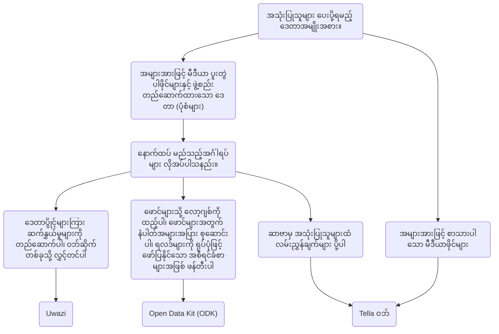

# အဖွဲ့အစည်းများအတွက် Tella - ခြုံငုံသုံးသပ်ချက်

အက်ပ်အတွင်း ဒေတာများကို ကာကွယ်ထားသည့်အပြင် အသုံးပြုသူများသည် ၎င်းတို့၏ အချက်အလက်များကို လုံခြုံစွာ အရန်သိမ်းဆည်းရန် ဆာဗာတစ်ခုနှင့်လည်း ချိတ်ဆက်နိုင်သည်။ ၎င်းသည် ပုံမှန်အားဖြင့် မြေပြင်ရှိ စေတနာ့ဝန်ထမ်းများ သို့မဟုတ် တက်ကြွလှုပ်ရှားသူများက စုဆောင်းထားသော အချက်အလက်များကို ဗဟိုပြုချုပ်ကိုင်ထားသည့် အဖွဲ့အစည်းများမှ စီမံခန့်ခွဲသော ဆာဗာဖြစ်သည်။ ဤမြေပြင်အသုံးပြုသူများသည် မိမိဖုန်းများတွင် Tella ကို အသုံးပြု၍ အချက်အလက်များကို စုဆောင်းပြီးနောက် ၎င်းတို့၏ အဖွဲ့အစည်းများထံ ပေးပို့သည်။

မြေပြင် အသုံးပြုသူများက ဒေတာစုဆောင်းပြီး အဖွဲ့အစည်းတစ်ခု၏ ဆာဗာသို့ ပေးပို့သည့် ယခင် Tella အသုံးပြုမှုများတွင် အသုံးပြုသူ ၁ ဦးမှ ၂,၀၀၀ ဦးအထိ ရှိခဲ့သည်။ 📲 📡။ အသုံးပြုသူ၏ ဇာတ်ကြောင်းများကို [ဤနေရာ](/user-stories) တွင် သင်ဖတ်နိုင်သည် သို့မဟုတ် သင့်အဖွဲ့အစည်းအတွက် Tella ကို အသုံးပြုရန် အကောင်းဆုံးနည်းလမ်းကို ရှာဖွေရာတွင် သင့်အား ကူညီနိုင်ရန် ကျွန်ုပ်တို့ထံ ဆက်သွယ်နိုင်ပါသည်။

လက်ရှိတွင် Tella သည် အောက်ပါ ဆာဗာအမျိုးအစားများသို့ ချိတ်ဆက်နိုင်သည်-

* [Open Data Kit (ODK)](#open-data-kit-odk)
* [Uwazi](#uwazi)
* [Tella ဝဘ်](#tella-web)

၎င်းတို့ကို Tella တွင် [ချိတ်ဆက်မှုများ](/features#connecting-to-servers) ဟု ခေါ်သည်။

## မှန်ကန်သော ဆာဗာအမျိုးအစားကို ရွေးချယ်ခြင်း {#selecting-the-right-type-of-server}

အောက်တွင် လိုအပ်ချက်အမျိုးမျိုးအတွက် ဆာဗာအမျိုးအစားသုံးမျိုးအနက်မှ မည်သည့် ဆာဗာအမျိုးအစားက အသင့်လျော်ဆုံးဖြစ်ကြောင်း ဆုံးဖြတ်ရာတွင် အထောက်အကူဖြစ်စေရန် အခြေခံကျ၍ အကြမ်းဖျင်းဖော်ပြထားသော ဂရပ်တစ်ခုကို ပြသထားပါသည်။ ၎င်းကို ကြည့်ရှု၍ စတင်လေ့လာနိုင်သော်လည်း ကျွန်ုပ်တို့၏ ဆာဗာအမျိုးအစားတစ်ခုစီကို [ဤဗီဒီယို](/video-tutorials#connections-full-video) တွင်လည်း ကြည့်ရှုလေ့လာနိုင်ပါသည်။ ဆုံးဖြတ်ရာတွင် အကူအညီလိုအပ်ပါက သို့မဟုတ် ချိတ်ဆက်မှုအသစ် (ဆာဗာအမျိုးအစားအသစ်သို့ ပေါင်းစပ်မှုတစ်ခု) တောင်းဆိုလိုပါက [ကျွန်ုပ်တို့ထံ ဆက်သွယ်ပါ။](/contact-us)

### Tella ဝဘ် {#tella-web}

Tella ဝဘ်သည် ဓာတ်ပုံများ၊ ဗီဒီယိုများနှင့် အသံဖိုင်များအပါအဝင် Tella အသုံးပြုသူများက ပေးပို့သော အစီရင်ခံစာများကို ဗဟိုချုပ်ကိုင်၍ စီမံခန့်ခွဲနိုင်စေရန် လူတစ်ဦးချင်းစီနှင့် အဖွဲ့အစည်းများကို ခွင့်ပြုထားသည့် ပွင့်လင်းအရင်းအမြစ် ကိရိယာတစ်ခုဖြစ်သည်။

Tella ဝဘ်သည် မိုဘိုင်းအက်ပ်၏ ဝဘ်ဗားရှင်းမဟုတ်ပါ၊ အက်ပ်ကို ဝဘ်အဖြစ်ပြောင်းလဲမည့်အစား Tella မှတစ်ဆင့် ပေးပို့သော အစီရင်ခံစာများကို အရိုးရှင်းဆုံးနည်းလမ်းဖြင့် စီမံခန့်ခွဲရန်နှင့် ဗဟိုပြုချုပ်ကိုင်ရန် အထူးရေးဆွဲထားသည့် ကိရိယာ ဖြစ်သည်။ သင်သည် Tella ဝဘ်ဖြင့် ပရောဂျက်များ ဖန်တီးနိုင်ပြီး အဆိုပါပရောဂျက်များသည် Tella အသုံးပြုသူများက အစီရင်ခံစာများ တင်သွင်းနိုင်သည့် ဖိုင်တွဲများကဲ့သို့ လုပ်ဆောင်ပါသည်။ ဥပမာအားဖြင့် သင်သည် ရဲအကြမ်းဖက်မှု၊ ကျား၊ မအခြေပြု အကြမ်းဖက်မှုနှင့် သဘာဝပတ်ဝန်းကျင်ဆိုင်ရာ ထိခိုက်ပျက်စီးမှုကဲ့သို့ တိကျသော ပထဝီဝင်နယ်မြေများ သို့မဟုတ် အကြောင်းအရာများအတွက် ပရောဂျက်များကို ဖန်တီးနိုင်သည်။ Tella ဝဘ်တွင် ပရောဂျက်တစ်ခုစီသို့ အစီရင်ခံစာများ အပ်လုဒ်လုပ်ခြင်း၊ မတူညီသော အခန်းကဏ္ဍများ ချမှတ်ပေးခြင်းနှင့် ခွင့်ပြုချက်များ သတ်မှတ်ပေးခြင်းတို့ ပြုလုပ်နိုင်စွမ်းရှိသော အသုံးပြုသူများကိုလည်း စီမံခန့်ခွဲနိုင်သည်။

Tella ဝဘ်ကို Horizontal ရှိ ကျွန်ုပ်တို့အသင်းက တီထွင်ထားပြီး အဆိုပါအသင်းကပင် Tella မိုဘိုင်းအက်ပ်များ တီထွင်ထုတ်လုပ်ရာတွင် တာဝန်ရှိပါသည်။ ၎င်းသည် အစီရင်ခံစာများကို လုံခြုံပြီး သီးသန့်ပုံစံဖြင့် စီမံခန့်ခွဲရန် အသုံးပြုရလွယ်ကူသော နည်းလမ်း ဖြစ်သည်။ သင့်အဖွဲ့အစည်းအတွင်း ၎င်းကို ထိန်းသိမ်းနိုင်သောသူ မရှိပါက Tella ဝဘ်ဆာဗာ တပ်ဆင်ခြင်းနှင့် စီမံသတ်မှတ်ခြင်းတို့အတွက် ကျွန်ုပ်တို့ ပံ့ပိုးပေးနိုင်ပါသည်။

Tella ဝဘ်ဆာဗာ ချိတ်ဆက်မှုသည် အသုံးပြုသူများအား လမ်းညွှန်များ၊ ရင်းမြစ်များနှင့် အချက်အလက်များကို ဆာဗာမှ Tella ၏ ကုဒ်ဝှက်ထားသော နေရာသို့ လုံခြုံစွာ တိုက်ရိုက် ဒေါင်းလုဒ်လုပ်ခွင့်လည်းပြုသည်။

Tella ဝဘ် ချိတ်ဆက်မှုကို Tella Android နှင့် Tella iOS တွင် ရနိုင်သော်လည်း [Tella-FOSS](/faq#is-tella-available-on-f-droid) တွင် မရရှိနိုင်သေးပါ။

Tella ဝဘ် အကြောင်း [ဤနေရာတွင်](/tella-web) ပိုမိုလေ့လာပါ၊

### Uwazi {#uwazi}

[Uwazi](/uwazi) သည် HURIDOCS မှ တီထွင်ထားသည့် မှတ်တမ်းတင်ခြင်းဆိုင်ရာ ပွင့်လင်းအရင်းအမြစ်ကိရိယာ ဖြစ်သည်။ ၎င်းသည် စာရွက်စာတမ်းများ၊ အထောက်အထားများ၊ အမှုများနှင့် တိုင်ကြားချက်များအပါအဝင် လူ့အခွင့်အရေး ကာကွယ်စောင့်ရှောက်သူများ၏ သတင်းအချက်အလက်စုဆောင်းမှုများကို စီမံခန့်ခွဲရန်အတွက် ပြောင်းလွယ်ပြင်လွယ်ရှိသော၊ ဝဘ်အခြေပြု ဒေတာဘေ့စ် အပလီကေးရှင်းတစ်ခု ဖြစ်သည်။ 

Uwazi ကို ဒေတာဘေ့စ်အဖြစ် အသုံးပြုသော အဖွဲ့အစည်းများသည် ဒေတာကို အပ်လုဒ်လုပ်ရန် Tella ကို ၎င်းတို့၏ ဒေတာဘေ့စ်တစ်ခု သို့မဟုတ် တစ်ခုထက်ပိုသော ဒေတာဘေ့စ်များသို့ ချိတ်ဆက်နိုင်သည်။ Tella နှင့် Uwazi ချိတ်ဆက်ရန် Uwazi ဒေတာဘေ့စ် URL၊ အသုံးပြုသူအမည်နှင့် စကားဝှက်တစ်ခုသာ လိုအပ်ပါသည်။ Uwazi ဒေတာဘေ့စ်တွင် Tella သို့ ဒေါင်းလုဒ်လုပ်နိုင်သည့် ပုံစံပြားတစ်ခုနှင့်အထက် စီစဉ်သတ်မှတ်ပြီးသားဖြစ်သင့်သည်။ အင်တာနက်ချိတ်ဆက်မှုမရှိသည့်တိုင် ဒေါင်းလုဒ်လုပ်ပြီးသည်နှင့် သုံးစွဲသူများသည် မှတ်တမ်းအသစ်တစ်ခုစီအတွက် အသေးစိတ်အချက်အလက်များကို ထည့်သွင်းရန် ၎င်းတို့၏ ပုံစံပြားများကြား အလွယ်တကူ သွားလာနိုင်သည်။ ဒေတာထည့်သွင်းမှု ပြီးသွားသောအခါ ၎င်းကို Tella အက်ပ်တွင် မူကြမ်းအဖြစ် သိမ်းဆည်းနိုင်သည် သို့မဟုတ် ချိတ်ဆက်ထားသော Uwazi ဒေတာဘေ့စ်သို့ ချက်ချင်း အပ်လုဒ်လုပ်နိုင်သည်။ ၎င်းသည် အော့ဖ်လိုင်းအလုပ်လုပ်သော အသုံးပြုသူများကို ဒေတာစုဆောင်းရန်နှင့် အဆင်ပြေသည့်အခါ အချက်အလက်ကို အပ်လုဒ်လုပ်ရန် ခွင့်ပြုပေးသည်။

Uwazi အကြောင်း ပိုမိုလေ့လာရန် အရင်းအမြစ်များ-
* Uwazi ချိတ်ဆက်မှုကို သရုပ်ပြသည့် ဗီဒီယိုကို [ဤနေရာ](/video-tutorials#uwazi) တွင် ကြည့်ပါ။
* [Uwazi ဖြင့် Tella ကို အသုံးပြုပုံအကြောင်း ထပ်လောင်းရှင်းပြချက်များ](/uwazi)။
* ချိတ်ဆက်မှုအကြောင်း [Uwazi အဖွဲ့မှ ဘလော့ပို့စ်](https://huridocs.org/2022/07/the-new-tella-app-lets-uwazi-users-document-violations-safely-and-while-offline/)။ 
* Uwazi [ဝဘ်ဆိုက်](https://uwazi.io/) နှင့် [စာရွက်စာတမ်းများ](https://uwazi.readthedocs.io/en/latest/)။

:::အကြံပြုချက်
Uwazi အကြောင်း [ဤနေရာတွင်](/uwazi) ပိုမိုလေ့လာပါ။
:::

### Open Data Kit (ODK) {#open-data-kit-odk}

[Open Data Kit (ODK)](https://getodk.org/) သည် စိတ်ကြိုက်ဖောင်များ ဖန်တီးရန်နှင့် ဒေတာစုဆောင်းရန်အတွက် အသုံးပြုသည့် ပွင့်လင်းစံနှုန်း ဖြစ်သည်။ Open Data Kit ဆာဗာနှင့် ချိတ်ဆက်ရန် ဦးစွာ ODK နှင့်ကိုက်ညီသော မည်သည့်ကိရိယာကိုမဆို အသုံးပြု၍ (စာသား၊ ရက်စွဲ၊ ပထဝီတည်နေရာ၊ မီဒီယာစသဖြင့်)  မတူညီသော မေးခွန်းအမျိုးအစားများပါသည့် ဖောင်များကို ဖန်တီးရန် လိုအပ်ပါသည်။

ကျွန်ုပ်တို့၏ [Open Data Kit ဆာဗာချိတ်ဆက်မှုစာမျက်နှာ](/odk) တွင် မည်သို့အကောင့် ဖန်တီးရမည်၊ ဖောင်ဖန်တီးခြင်းနှင့် Tella မှ ဆာဗာသို့ ချိတ်ဆက်ပုံနှင့် ပတ်သက်သော အချက်အလက်များကို မည်သည့်နေရာတွင် ရှာဖွေရမည်တို့ကို ရှင်းပြထားပါသည်။ ODK ချိတ်ဆက်မှု၏ သရုပ်ဖော်ပုံကို [ဤနေရာတွင် ](/video-tutorials#open-data-kit) လည်း ကြည့်နိုင်ပါသည်။ သင်သည် Open Data Kit ကို အသုံးပြုရန် စဉ်းစားနေပါက သို့မဟုတ် သင့်ဖြစ်ရပ်ကို [အသုံးပြုရန်](/faq#deploying-tella) အကူအညီ လိုအပ်ပါက ကျေးဇူးပြု၍ [ကျွန်ုပ်တို့ထံ ဆက်သွယ်ပါ](/contact-us)။ 

:::info
ODK ချိတ်ဆက်မှုကို [Android တွင်သာ ရရှိနိုင်သည်](/features)။
:::

:::အကြံပြုချက်
Open Data Kit အကြောင်း [ဤနေရာတွင်](/odk) ပိုမိုလေ့လာပါ။
:::

