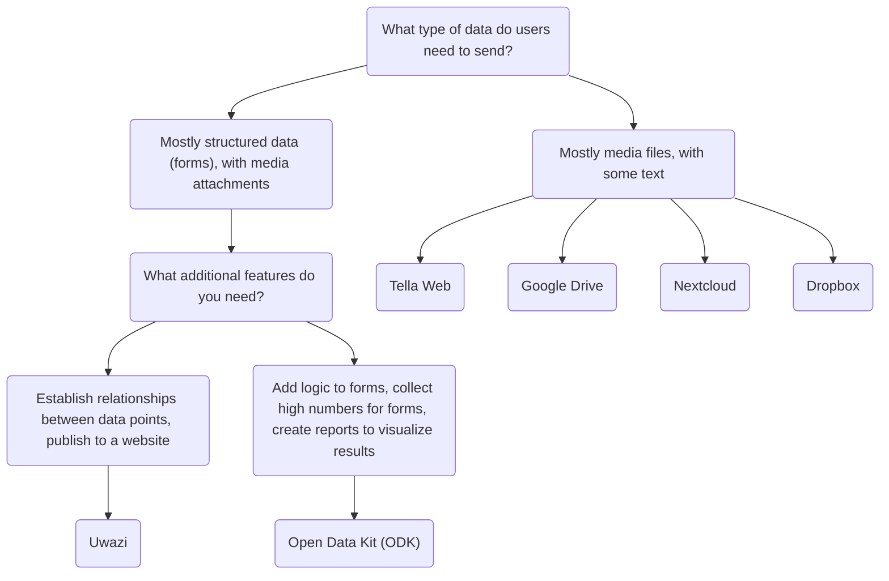

import ConnectionsTable from '.././_connections-table.md';
import Button from '@site/src/components/Button';

# Tella for organizations

Server connections are useful for organizations leading data collection processes. Organizations can choose, configure, and manage a server where they can centralize the data collected by volunteers or activists on the ground. These individuals gather information using Tella on their phones and then send it to their organizations.

Previous Tella deployments, where on-the-ground users collected data and sent it to an organization's server, have ranged from 1 to 2,000 users. You can read user stories [here](/user-stories), or you can [contact us](/contact-us) so that we can assist you in finding the best way to use Tella for your organization.

Atualmente, o Tella pode ser conectado aos seguintes tipos de servidores:

* [Open Data Kit (ODK)](/odk)
* [Uwazi](/uwazi)
* [Tella Web](/tella-web)
* [Google Drive](/g-drive)
* [Nextcloud](/nextcloud)
* [Dropbox](/dropbox)

These are called [Connections](/features#connecting-to-servers) in Tella. 

:::danger
For now, any files you submit to a connection might stored unencrypted on that server or drive (that depends on the server configuration). This means that anyone with permission to access the content of that server or drive may be able to view those files. While the connection used to submit files is secured via HTTPS, the files themselves must be decrypted to be accessed outside of the Tella vault.

We strongly recommend reviewing and understanding the permission model of each connection you use, in order to determine which option is safest and most appropriate for your specific use case.
:::

## Selecionando o tipo correto de servidor {#selecting-the-right-type-of-server}

The following is a basic, non-comprehensive graph to help determine which server types is best suited to different needs. This is a good starting point, but you can also watch [this video](/video-tutorials#connections-full-video) where we present each server type. If you need help deciding or would like to request a new Connection (an integration to a new server type), [contact us!](/contact-us).

On this table we explain what server types are available on the Tella apps:
<ConnectionsTable/>

:::info
For offline file sharing or during internet shutdowns, [Nearby Sharing](/nearby-sharing) could be helpful.  If you need to share files with other apps the [Share button](/features#share-button) could be useful.
:::

### Tella Web {#tella-web}

Tella Web é uma ferramenta de código aberto que permite a indivíduos e organizações centralizar e gerenciar relatórios enviados por usuários do Tella, incluindo fotos, vídeos, documentos em PDF e arquivos de áudio.

Não é o equivalente do aplicativo móvel; ao invés disso, é uma ferramenta especificamente projetada para a centralização e gerenciamento dos relatórios enviados via Tella da maneira mais simples possível. Com o Tella Web, você pode criar projetos, que funcionam como pastas nas quais usuários do Tella podem submeter relatórios. Por exemplo, você pode criar projetos para áreas geográficas específicas ou temas como violência policial, violência de gênero e ofensas ao meio ambiente. No Tella Web, você também pode gerenciar os usuários que podem carregar relatórios para cada projeto, designar funções diferentes e definir permissões.

Tella Web é desenvolvido internamente pela nossa equipe na Horizontal, a mesma responsável por desenvolver os aplicativos para dispositivos móveis do Tella. É  uma solução amigável ao usuário para gerenciar relatórios de maneira segura e privativa. Podemos fornecer suporte para a instalação e configuração de um servidor Tella Web caso você não conte com alguém na sua organização que possa mantê-lo.

A conexão do servidor Tella Web também permite que os usuários façam o download seguro de guias, recursos e informações do servidor diretamente para o contêiner criptografado do Tella.

<Button label="Continue reading about the Tella Web connection " link="/tella-web"/>

### Uwazi {#uwazi}

[Uwazi](/uwazi) é uma ferramenta de documentação de código aberto desenvolvida pela HURIDOCS. É uma aplicação de banco de dados flexível e nativa da web projetada para defensores dos direitos humanos gerenciarem suas coleções de informação, incluindo documentos, evidências, casos e queixas.

Organizações que utilizam Uwazi como um banco de dados podem conectar o Tella a um ou mais bancos de dados para carregar dados. As únicas exigências para conectar o Tella ao Uwazi são a URL do banco de dados Uwazi e um nome de usuário e senha. O banco de dados Uwazi já deve ter um ou mais templates configurados, os quais podem ser baixados para o Tella. Após completar o download com sucesso, os usuários podem facilmente navegar entre seus templates para inserir detalhes para cada novo registro, mesmo quando não há conexão com a internet. Quando a entrada de dados estiver completa, ela pode ser salva como um rascunho no aplicativo Tella ou imediatamente carregada para o banco de dados Uwazi conectado. Isso permite a usuários que trabalham offline coletar dados e carregá-los quando for conveniente.

<Button label="Continue reading about the Uwazi connection " link="/uwazi"/>

### Open Data Kit (ODK) {#open-data-kit-odk}

The [Open Data Kit (ODK)](https://getodk.org/) is an open standard used to create custom forms and collect data. In order to connect a Open Data Kit server, first you need to create forms with different questions types (text, date, geolocation, media, etc) using any of the tools that are ODK-compliant.

On our [Open Data Kit server connection page](/odk) we explain how to create an account, where to find information about creating forms and how to connect to the server from Tella. You can also watch a demonstration of the ODK connection [here](/video-tutorials#open-data-kit). If you are considering using Open Data Kit or you need help to [deploy](/faq#deploying-tella) your instance, please [contact us](/contact-us). 

:::note
The ODK connection is [not available on Tella iOS](/features). 
:::

<Button label="Continue reading about the Open Data Kit connection " link="/odk"/>

### Google Drive {#g-drive}

Users can sign-in directly to their Google account from within Tella and upload files to a folder in their Drive account. Each "report" uploaded will create a new folder in the user's Google Drive.

As for all Connections in Tella, users can use most of the Google Drive connection offline through the Draft, Outbox and Submit Later tabs. 

<Button label="Continue reading about the Google Drive connection " link="/g-drive"/>

Users can sign-in directly to their Google account from within Tella and upload files to a folder in their Drive account. Each "report" uploaded will create a new folder in the user's Google Drive.

As for all Connections in Tella, users can use most of the Google Drive connection offline through the Draft, Outbox and Submit Later tabs. 

:::note
The Google Drive connection is not available in Tella Android FOSS, because it uses closed-sourced libraries.
:::

### Nextcloud {#Nextcloud}
Users can sign-in directly to their Nextcloud account from within Tella and upload files to a folder in their Nextcloud account. Each "report" uploaded will create a new folder in the user's Nextcloud.

As for all Connections in Tella, users can use most of the Nextcloud connection offline through the Draft, Outbox and Submit Later tabs. 

<Button label="Continue reading about the Nextcloud connection " link="/nextcloud"/>

### Dropbox {#dropbox}
Users can sign-in directly to their Dropbox account from within Tella and upload files to a folder in their account. In the "Applications" folder in the user's Dropbox account, a new folder "Tella" will automatically be created. Each Report uploaded from Tella will create a new subfolder inside the "Tella" folder.

As for all Connections in Tella, users can use most of the Dropbox connection offline through the Draft, Outbox and Submit Later tabs. 

<Button label="Continue reading about the Dropbox connection " link="/dropbox"/>

:::note
The Dropbox connection is not available in Tella Android FOSS, because it uses closed-sourced libraries.
:::

