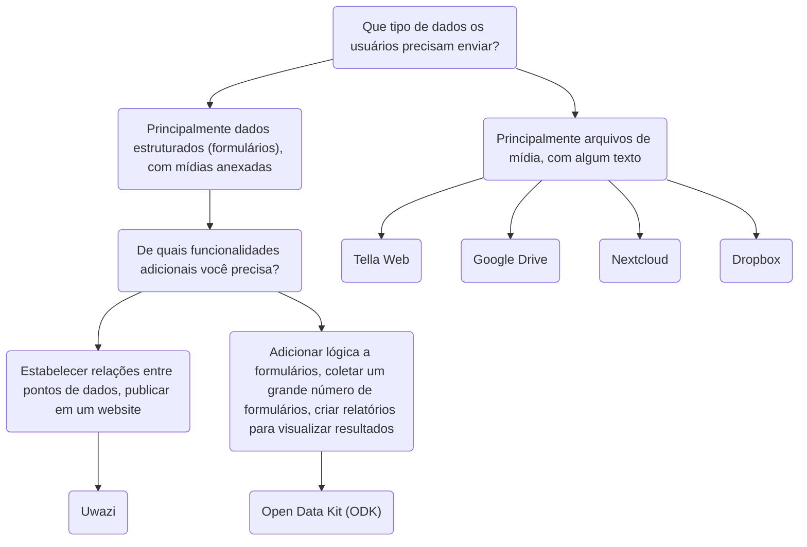

import ConnectionsTable from '.././_connections-table.mdx';
import Button from '@site/src/components/Button';
import Admonition from '@theme/Admonition';

# Tella para organizações - Visão Geral

Para além de manter os dados protegidos dentro do aplicativo, usuários podem também conectar-se a um servidor para fazer backup de seus dados de forma segura. Este é tipicamente um servidor mantido por organizações, nos quais elas podem centralizar os dados coletados por voluntários ou ativistas nos campos de atuação. Esses indivíduos reúnem informações usando Tella em seus telefones e, então, enviam para as organizações.

Implantações anteriores do Tella, nas quais usuários nos campos de atuação coletavam dados e enviavam para um servidor da organização, variaram entre 1 e 2.000 usuários. 📲 📡. Você pode ler histórias de usuários [aqui](/user-stories), ou entrar em contato conosco para que possamos te ajudar a encontrar a melhor forma de usar o Tella na sua organização.

Atualmente, o Tella pode ser conectado aos seguintes tipos de servidores:

* [Open Data Kit (ODK)](/odk)
* [Uwazi](/uwazi)
* [Tella Web](/tella-web)
* [Google Drive](/g-drive)
* [Nextcloud](/nextcloud)
* [Dropbox](/dropbox)

Estes são chamados [Conexões](/features#connecting-to-servers) no Tella.

<Admonition type="danger">
For now, any files you submit to a connection might stored unencrypted on that server or drive (that depends on the server configuration). This means that anyone with permission to access the content of that server or drive may be able to view those files. While the connection used to submit files is secured via HTTPS, the files themselves must be decrypted to be accessed outside of the Tella vault.

We strongly recommend reviewing and understanding the permission model of each connection you use, in order to determine which option is safest and most appropriate for your specific use case.
</Admonition>

## Selecionando o tipo correto de servidor {/* #selecting-the-right-type-of-server */}

Abaixo está um esquema básico e não abrangente para ajudar a determinar qual dos três tipos de servidor é mais adequado a diferentes necessidades. Esse é um bom ponto inicial, mas você também pode assistir a [esse vídeo](/video-tutorials#connections-full-video), no qual apresentamos cada tipo de servidor. Caso precise de ajuda para decidir ou deseje solicitar uma nova Conexão (uma integração com um novo tipo de servidor), [fale conosco!](/contact-us)

On this table we explain what server types are available on the Tella apps:
<ConnectionsTable/>

<Admonition type="info">
For offline file sharing or during internet shutdowns, [Nearby Sharing](/nearby-sharing) could be helpful.  If you need to share files with other apps the [Share button](/features#share-button) could be useful.
</Admonition>

### Tella Web {/* #tella-web */}

Tella Web é uma ferramenta de código aberto que permite a indivíduos e organizações centralizar e gerenciar relatórios enviados por usuários do Tella, incluindo fotos, vídeos, documentos em PDF e arquivos de áudio.

Não é o equivalente do aplicativo móvel; ao invés disso, é uma ferramenta especificamente projetada para a centralização e gerenciamento dos relatórios enviados via Tella da maneira mais simples possível. Com o Tella Web, você pode criar projetos, que funcionam como pastas nas quais usuários do Tella podem submeter relatórios. Por exemplo, você pode criar projetos para áreas geográficas específicas ou temas como violência policial, violência de gênero e ofensas ao meio ambiente. No Tella Web, você também pode gerenciar os usuários que podem carregar relatórios para cada projeto, designar funções diferentes e definir permissões.

Tella Web é desenvolvido internamente pela nossa equipe na Horizontal, a mesma responsável por desenvolver os aplicativos para dispositivos móveis do Tella. É  uma solução amigável ao usuário para gerenciar relatórios de maneira segura e privativa. Podemos fornecer suporte para a instalação e configuração de um servidor Tella Web caso você não conte com alguém na sua organização que possa mantê-lo.

A conexão do servidor Tella Web também permite que os usuários façam o download seguro de guias, recursos e informações do servidor diretamente para o contêiner criptografado do Tella.

<Button label="Continue reading about the Tella Web connection " link="/tella-web"/>

### Uwazi {/* #uwazi */}

[Uwazi](/uwazi) é uma ferramenta de documentação de código aberto desenvolvida pela HURIDOCS. É uma aplicação de banco de dados flexível e nativa da web projetada para defensores dos direitos humanos gerenciarem suas coleções de informação, incluindo documentos, evidências, casos e queixas.

Organizações que utilizam Uwazi como um banco de dados podem conectar o Tella a um ou mais bancos de dados para carregar dados. As únicas exigências para conectar o Tella ao Uwazi são a URL do banco de dados Uwazi e um nome de usuário e senha. O banco de dados Uwazi já deve ter um ou mais templates configurados, os quais podem ser baixados para o Tella. Após completar o download com sucesso, os usuários podem facilmente navegar entre seus templates para inserir detalhes para cada novo registro, mesmo quando não há conexão com a internet. Quando a entrada de dados estiver completa, ela pode ser salva como um rascunho no aplicativo Tella ou imediatamente carregada para o banco de dados Uwazi conectado. Isso permite a usuários que trabalham offline coletar dados e carregá-los quando for conveniente.

<Button label="Continue reading about the Uwazi connection " link="/uwazi"/>

### Open Data Kit (ODK) {/* #open-data-kit-odk */}

O [Open Data Kit (ODK)](https://getodk.org/) é um padrão aberto usado para criar formulários personalizados e coletar dados. Para conectar um servidor Open Data Kit, você primeiro precisa criar formulários com diferentes tipos de questões (texto, data, geolocalização, mídia, etc.) usando quaisquer das ferramentas em conformidade com o ODK.

Em nossa [página sobre a conexão do servidor Open Data Kit](/odk) explicamos como criar uma conta, onde encontrar informações sobre a criação de formulários e como conectar-se ao servidor a partir do Tella. Você também pode ver uma demonstração da conexão ODK [aqui](/video-tutorials#open-data-kit). Se está considerando usar o Open Data Kit ou precisa de ajuda para [implantar](/faq#deploying-tella) sua instância, por favor [entre em contato conosco](/contact-us).

<Admonition type="note">
A conexão ODK está [somente disponível no Android](/features).
</Admonition>

<Button label="Continue reading about the Open Data Kit connection " link="/odk"/>

### Google Drive {/* #g-drive */}

Users can sign-in directly to their Google account from within Tella and upload files to a folder in their Drive account. Each "report" uploaded will create a new folder in the user's Google Drive.

As for all Connections in Tella, users can use most of the Google Drive connection offline through the Draft, Outbox and Submit Later tabs. 

<Button label="Continue reading about the Google Drive connection " link="/g-drive"/>

Users can sign-in directly to their Google account from within Tella and upload files to a folder in their Drive account. Each "report" uploaded will create a new folder in the user's Google Drive.

As for all Connections in Tella, users can use most of the Google Drive connection offline through the Draft, Outbox and Submit Later tabs. 

<Admonition type="note">
The Google Drive connection is not available in Tella Android FOSS, because it uses closed-sourced libraries.
</Admonition>

### Nextcloud {/* #Nextcloud */}
Users can sign-in directly to their Nextcloud account from within Tella and upload files to a folder in their Nextcloud account. Each "report" uploaded will create a new folder in the user's Nextcloud.

As for all Connections in Tella, users can use most of the Nextcloud connection offline through the Draft, Outbox and Submit Later tabs. 

<Button label="Continue reading about the Nextcloud connection " link="/nextcloud"/>

### Dropbox {/* #dropbox */}
Users can sign-in directly to their Dropbox account from within Tella and upload files to a folder in their account. In the "Applications" folder in the user's Dropbox account, a new folder "Tella" will automatically be created. Each Report uploaded from Tella will create a new subfolder inside the "Tella" folder.

As for all Connections in Tella, users can use most of the Dropbox connection offline through the Draft, Outbox and Submit Later tabs. 

<Button label="Continue reading about the Dropbox connection " link="/dropbox"/>

<Admonition type="note">
The Dropbox connection is not available in Tella Android FOSS, because it uses closed-sourced libraries.
</Admonition>

