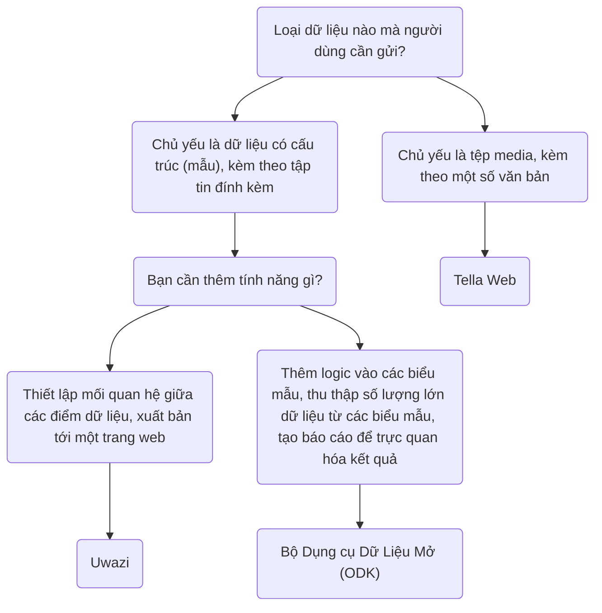

import ConnectionsTable from '.././_connections-table.md';
import Button from '@site/src/components/Button';

# Tella for organizations

Server connections are useful for organizations leading data collection processes. Organizations can choose, configure, and manage a server where they can centralize the data collected by volunteers or activists on the ground. These individuals gather information using Tella on their phones and then send it to their organizations.

Previous Tella deployments, where on-the-ground users collected data and sent it to an organization's server, have ranged from 1 to 2,000 users. You can read user stories [here](/user-stories), or you can [contact us](/contact-us) so that we can assist you in finding the best way to use Tella for your organization.

* [Bộ Công cụ Dữ liệu Mở (ODK)](#open-data-kit-odk)
* [Uwazi](#uwazi)
* [Tella Web](#tella-web)

Chúng được gọi là [Kết nối](/features#connecting-to-servers) trong Tella.

## Lựa chọn loại máy chủ phù hợp {#selecting-the-right-type-of-server}

Sau đây là biểu đồ cơ bản, không đầy đủ để xác định xem loại nào trong ba loại máy chủ phù hợp nhất với các nhu cầu khác nhau. Đây là điểm bắt đầu tốt, nhưng bạn cũng có thể xem [video này](/video-tutorials#connections-full-video) để tìm hiểu chi tiết về từng loại máy chủ. Nếu bạn cần trợ giúp trong việc lựa chọn hoặc muốn yêu cầu một Kết Nối mới (tích hợp với loại máy chủ mới), [hãy liên hệ với chúng tôi!](/contact-us)

These are called [Connections](/features#connecting-to-servers) in Tella. 

:::danger
For now, any files you submit to a connection might stored unencrypted on that server or drive (that depends on the server configuration). This means that anyone with permission to access the content of that server or drive may be able to view those files. While the connection used to submit files is secured via HTTPS, the files themselves must be decrypted to be accessed outside of the Tella vault.

We strongly recommend reviewing and understanding the permission model of each connection you use, in order to determine which option is safest and most appropriate for your specific use case.
:::

### Tella Web {#tella-web}

Tella Web không phải là phiên bản Web của ứng dụng di động; mà đây là một công cụ được thiết kế riêng để tổng hợp và quản lý các báo cáo được gửi thông qua Tella một cách đơn giản nhất có thể. Với Tella Web, bạn có thể tạo các dự án có chức năng như các thư mục, nơi người dùng Tella có thể gửi các báo cáo đến. Ví dụ, bạn có thể tạo các dự án cho các khu vực địa lý cụ thể hoặc những chủ đề như cảnh sát bạo hành, bạo lực giới tính và xâm hại môi trường. Trên Tella Web, bạn cũng có thể quản lý người dùng , là những người được quyền tải lên các báo cáo cho từng dự án qua chức năng thiết lập quyền hạn và chỉ định những vai trò khác nhau.

Tella Web được phát triển nội bộ bởi đội ngũ của chúng tôi tại Horizontal, đội ngũ này cũng phụ trách việc phát triển ứng dụng di động của Tella. Đây là giải pháp thân thiện với người dùng  trong việc quản lý các báo cáo một cách an toàn và riêng tư. Bên cạnh đó, chúng tôi còn cung cấp hỗ trợ việc cài đặt cấu hình máy chủ Web Tella nếu chưa có ai trong tổ chức của bạn có thể đảm nhiệm nó.

Kết nối Tella Web có sẵn trên Tella Android và Tella iOS, nhưng chưa có trên [Tella-FOSS](/faq#is-tella-available-on-f-droid). 

Tìm hiểu thêm Tella Web [tại đây](/tella-web)

<Button label="Continue reading about the Tella Web connection " link="/tella-web"/>

:::info
For offline file sharing or during internet shutdowns, [Nearby Sharing](/nearby-sharing) could be helpful.  If you need to share files with other apps the [Share button](/features#share-button) could be useful.
:::

### Uwazi {#uwazi}

[Uwazi](/uwazi) là một công cụ tài liệu mã nguồn mở được phát triển bởi HURIDOCS. Đây là một ứng dụng cơ sở dữ liệu trên web được thiết kế linh hoạt dành cho nhà bảo vệ nhân quyền trong việc quản lý bộ sưu tập thông tin của mình, bao gồm tài liệu, bằng chứng, các vụ việc và những khiếu nại. 

Các tổ chức sử dụng Uwazi như một cơ sở dữ liệu có thể kết nối Tella với một hoặc nhiều cơ sở dữ liệu của họ để tải tài liệu lên. Để kết nối Tella với Uwazi, bạn chỉ cần URL của cơ sở dữ liệu Uwazi, cùng với tên đăng nhập và mật khẩu. Cơ sở dữ liệu Uwazi cần phải có sẵn một hoặc nhiều mẫu đã được cấu hình, có thể tải về Tella. Sau khi tải xuống thành công, người dùng có thể dễ dàng chuyển đổi giữa các mẫu để nhập chi tiết cho mỗi hồ sơ lưu trữ mới, ngay cả khi không có kết nối internet. Khi việc nhập dữ liệu hoàn tất, nó có thể được lưu dưới dạng bản nháp trong ứng dụng Tella hoặc được tải lên ngay lập tức vào cơ sở dữ liệu Uwazi đã được kết nối. Điều này cho phép người dùng làm việc ngoại tuyến để thu thập dữ liệu và tải lên thông tin khi thuận tiện.

Nguồn thông tin để tìm hiểu thêm về Uwazi:

* video hướng dẫn cách kết nối với Uwazi [tại đây](/video-tutorials#uwazi).
* [Thêm thông tin về cách sử dụng Tella với Uwazi](/uwazi).

<Button label="Continue reading about the Uwazi connection " link="/uwazi"/>

### Bộ Công Cụ Dữ Liệu Mở (ODK) {#open-data-kit-odk}

[Bộ Công cụ Dữ liệu Mở (ODK)](https://getodk.org/) là một tiêu chuẩn mở được sử dụng để thu thập dữ liệu và tạo biểu mẫu tùy chỉnh. Để kết nối với máy chủ ODK, trước tiên bạn cần tạo các biểu mẫu với những loại câu hỏi khác nhau (văn bản, ngày tháng, vị trí địa lý, phương tiện, v.v.) bằng cách sử dụng bất kỳ công cụ nào tương thích với ODK.

Trên trang [Kết nối với máy chủ Bộ Công cụ Dữ liệu Mở](/odk), chúng tôi có giải thích cách tạo tài khoản, cách tìm thông tin về việc tạo biểu mẫu và cách kết nối với máy chủ từ Tella. Nếu bạn đang xem xét việc sử dụng Bộ Công cụ Dữ liệu Mở hoặc bạn cần sự trợ giúp để [triển khai](/faq#deploying-tella) phiên bản của mình, xin [liên hệ với chúng tôi](/contact-us).

:::note
The ODK connection is [not available on Tella iOS](/features). 
:::

<Button label="Continue reading about the Open Data Kit connection " link="/odk"/>

### Google Drive {#g-drive}

Users can sign-in directly to their Google account from within Tella and upload files to a folder in their Drive account. Each "report" uploaded will create a new folder in the user's Google Drive.

As for all Connections in Tella, users can use most of the Google Drive connection offline through the Draft, Outbox and Submit Later tabs.

:::note
The Google Drive connection is not available in Tella Android FOSS, because it uses closed-sourced libraries.
:::

<Button label="Continue reading about the Google Drive connection " link="/g-drive"/>

### Nextcloud {#Nextcloud}

Users can sign-in directly to their Nextcloud account from within Tella and upload files to a folder in their Nextcloud account. Each "report" uploaded will create a new folder in the user's Nextcloud.

As for all Connections in Tella, users can use most of the Nextcloud connection offline through the Draft, Outbox and Submit Later tabs. 

<Button label="Continue reading about the Nextcloud connection " link="/nextcloud"/>

### Dropbox {#dropbox}

Users can sign-in directly to their Dropbox account from within Tella and upload files to a folder in their account. In the "Applications" folder in the user's Dropbox account, a new folder "Tella" will automatically be created. Each Report uploaded from Tella will create a new subfolder inside the "Tella" folder.

As for all Connections in Tella, users can use most of the Dropbox connection offline through the Draft, Outbox and Submit Later tabs. 

:::note
The Dropbox connection is not available in Tella Android FOSS, because it uses closed-sourced libraries.
:::

<Button label="Continue reading about the Dropbox connection " link="/dropbox"/>

