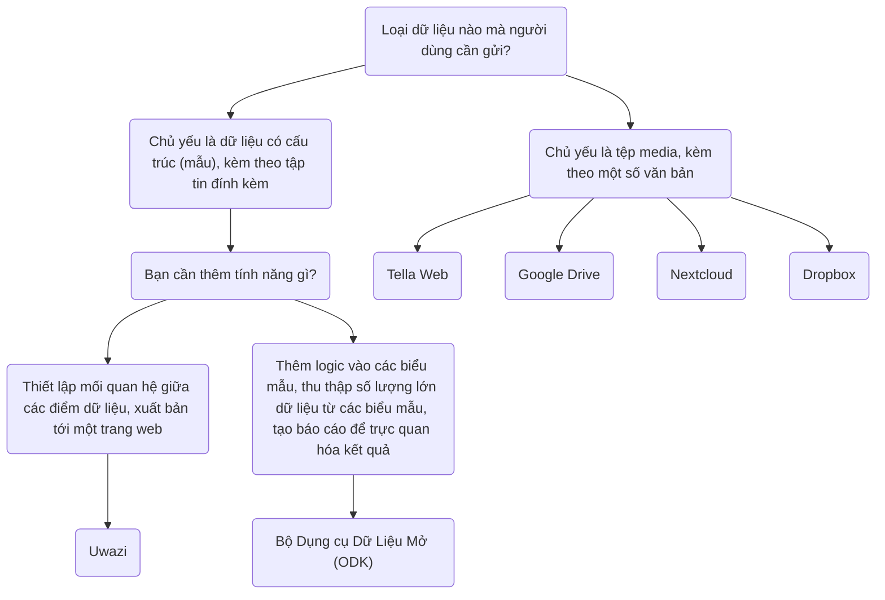

import ConnectionsTable from '.././_connections-table.mdx';
import Button from '@site/src/components/Button';

# Tella cho các tổ chức - Tổng quan

Ngoài việc bảo vệ dữ liệu trong ứng dụng, người dùng cũng có thể kết nối với máy chủ để sao lưu dữ liệu một cách an toàn. Thông thường, đây là máy chủ do các tổ chức quản lý, nơi họ có thể tập trung dữ liệu do các tình nguyện viên hoặc nhà hoạt động thu thập trên thực địa. Những cá nhân này sử dụng Tella trên điện thoại của họ để thu thập thông tin và sau đó gửi đến tổ chức của họ.

Previous Tella deployments, where on-the-ground users collected data and sent it to an organization's server, have ranged from 1 to 2,000 users. You can read user stories [here](/user-stories), or you can [contact us](/contact-us) so that we can assist you in finding the best way to use Tella for your organization.

Hiện tại, Tella có thể kết nối với các loại máy chủ sau:

* [Open Data Kit (ODK)](/odk)
* [Uwazi](/uwazi)
* [Tella Web](/tella-web)
* [Google Drive](/g-drive)
* [Nextcloud](/nextcloud)
* [Dropbox](/dropbox)

These are called [Connections](/features#connecting-to-servers) in Tella.

:::danger For now, any files you submit to a connection might stored unencrypted on that server or drive (that depends on the server configuration). This means that anyone with permission to access the content of that server or drive may be able to view those files. While the connection used to submit files is secured via HTTPS, the files themselves must be decrypted to be accessed outside of the Tella vault.

We strongly recommend reviewing and understanding the permission model of each connection you use, in order to determine which option is safest and most appropriate for your specific use case. :::

## Lựa chọn loại máy chủ phù hợp {/* #selecting-the-right-type-of-server */}

The following is a basic, non-comprehensive graph to help determine which server types is best suited to different needs. This is a good starting point, but you can also watch [this video](/video-tutorials#connections-full-video) where we present each server type. If you need help deciding or would like to request a new Connection (an integration to a new server type), [contact us!](/contact-us).

On this table we explain what server types are available on the Tella apps:
<ConnectionsTable/>

:::info For offline file sharing or during internet shutdowns, check out [Nearby Sharing](/nearby-sharing). :::

:::info If you need to share files through other apps, use the [Share button](/features#share-button). :::

### Tella Web {/* #tella-web */}

Tella Web là một công cụ mã nguồn mở cho phép các cá nhân và tổ chức tổng hợp và quản lý các báo cáo do người dùng Tella gửi, bao gồm ảnh, video, tài liệu pdf và tệp âm thanh.

Tella Web không phải là phiên bản Web của ứng dụng di động; mà đây là một công cụ được thiết kế riêng để tổng hợp và quản lý các báo cáo được gửi thông qua Tella một cách đơn giản nhất có thể. Với Tella Web, bạn có thể tạo các dự án có chức năng như các thư mục, nơi người dùng Tella có thể gửi các báo cáo đến. Ví dụ, bạn có thể tạo các dự án cho các khu vực địa lý cụ thể hoặc những chủ đề như cảnh sát bạo hành, bạo lực giới tính và xâm hại môi trường. Trên Tella Web, bạn cũng có thể quản lý người dùng , là những người được quyền tải lên các báo cáo cho từng dự án qua chức năng thiết lập quyền hạn và chỉ định những vai trò khác nhau.

Tella Web được phát triển nội bộ bởi đội ngũ của chúng tôi tại Horizontal, đội ngũ này cũng phụ trách việc phát triển ứng dụng di động của Tella. Đây là giải pháp thân thiện với người dùng trong việc quản lý các báo cáo một cách an toàn và riêng tư. Bên cạnh đó, chúng tôi còn cung cấp hỗ trợ việc cài đặt cấu hình máy chủ Web Tella nếu chưa có ai trong tổ chức của bạn có thể đảm nhiệm nó.

The Tella Web server connection also allows users to securely download guides, resources and information from the server directly to Tella's encrypted container.

<Button label="Continue reading about the Tella Web connection " link="/tella-web"/>

### Uwazi {/* #uwazi */}

[Uwazi](/uwazi) is an open-source documentation tool developed by HURIDOCS. It is a flexible, web-based database application designed for human rights defenders to manage their collections of information, including documents, evidence, cases and complaints.

Các tổ chức sử dụng Uwazi như một cơ sở dữ liệu có thể kết nối Tella với một hoặc nhiều cơ sở dữ liệu của họ để tải tài liệu lên. Để kết nối Tella với Uwazi, bạn chỉ cần URL của cơ sở dữ liệu Uwazi, cùng với tên đăng nhập và mật khẩu. Cơ sở dữ liệu Uwazi cần phải có sẵn một hoặc nhiều mẫu đã được cấu hình, có thể tải về Tella. Sau khi tải xuống thành công, người dùng có thể dễ dàng chuyển đổi giữa các mẫu để nhập chi tiết cho mỗi hồ sơ lưu trữ mới, ngay cả khi không có kết nối internet. Khi việc nhập dữ liệu hoàn tất, nó có thể được lưu dưới dạng bản nháp trong ứng dụng Tella hoặc được tải lên ngay lập tức vào cơ sở dữ liệu Uwazi đã được kết nối. Điều này cho phép người dùng làm việc ngoại tuyến để thu thập dữ liệu và tải lên thông tin khi thuận tiện.

<Button label="Continue reading about the Uwazi connection " link="/uwazi"/>

### Bộ Công Cụ Dữ Liệu Mở (ODK) {/* #open-data-kit-odk */}

The [Open Data Kit (ODK)](https://getodk.org/) is an open standard used to create custom forms and collect data. In order to connect a Open Data Kit server, first you need to create forms with different questions types (text, date, geolocation, media, etc) using any of the tools that are ODK-compliant.

On our [Open Data Kit server connection page](/odk) we explain how to create an account, where to find information about creating forms and how to connect to the server from Tella. You can also watch a demonstration of the ODK connection [here](/video-tutorials#open-data-kit). If you are considering using Open Data Kit or you need help to [deploy](/faq#deploying-tella) your instance, please [contact us](/contact-us).

:::note The ODK connection is [not available on Tella iOS](/features). :::

<Button label="Continue reading about the Open Data Kit connection " link="/odk"/>

### Google Drive {/* #g-drive */}

Users can sign-in directly to their Google account from within Tella and upload files to a folder in their Drive account. Each "report" uploaded will create a new folder in the user's Google Drive.

As for all Connections in Tella, users can use most of the Google Drive connection offline through the Draft, Outbox and Submit Later tabs.

<Button label="Continue reading about the Google Drive connection " link="/g-drive"/>

:::note The Google Drive connection is not available in Tella Android FOSS, because it uses closed-sourced libraries. :::

### Nextcloud {/* #Nextcloud */}
Users can sign-in directly to their Nextcloud account from within Tella and upload files to a folder in their Nextcloud account. Each "report" uploaded will create a new folder in the user's Nextcloud.

As for all Connections in Tella, users can use most of the Nextcloud connection offline through the Draft, Outbox and Submit Later tabs.

<Button label="Continue reading about the Nextcloud connection " link="/nextcloud"/>

### Dropbox {/* #dropbox */}
Users can sign-in directly to their Dropbox account from within Tella and upload files to a folder in their account. In the "Applications" folder in the user's Dropbox account, a new folder "Tella" will automatically be created. Each Report uploaded from Tella will create a new subfolder inside the "Tella" folder.

As for all Connections in Tella, users can use most of the Dropbox connection offline through the Draft, Outbox and Submit Later tabs.

<Button label="Continue reading about the Dropbox connection " link="/dropbox"/>

:::note The Dropbox connection is not available in Tella Android FOSS, because it uses closed-sourced libraries. :::

